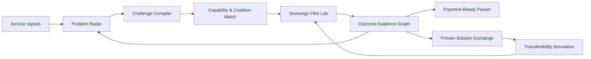
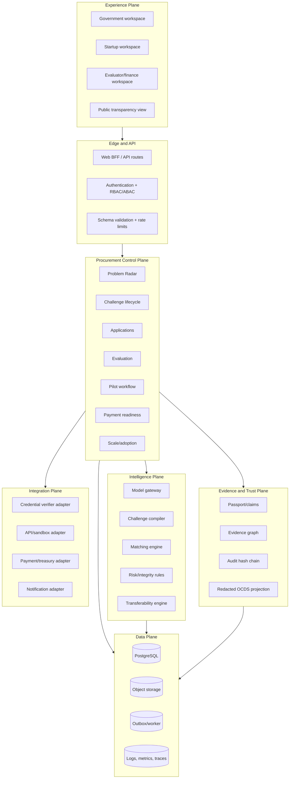

# TRUTH — SIH 2026 Startup-Friendly Public Procurement Platform

> The append-only single source of truth for this project.
>
> **Project window:** 2026-08-31 through 2026-09-05 (Asia/Kolkata)  
> **Deadline:** 2026-09-05  
> **Status:** Foundation implementation in progress
> **Canonical file:** `Truth.md` at the repository root

---

## 0. How to use this document

`Truth.md` is the curated single source of truth for **what the project is**: the problem, users, scope, product behavior, architecture, data model, security model, decisions, research, risks, backlog, acceptance criteria, and delivery strategy.

It is intentionally separate from contributor activity tracking:

- `Truth.md` contains current project details and durable product decisions.
- `WORKLOG.md` is the append-only record of people, time slots, sessions, changes, checkpoints, tests, partial work, blockers, and handoffs.
- `AGENTS.md` and `CLAUDE.md` contain mandatory working rules for agents and contributors.

### 0.1 Rules for maintaining Truth.md

1. Read this entire file before making product or architectural changes.
2. Keep it current, cohesive, and free of session-by-session work logs.
3. Update it when requirements, scope, architecture, interfaces, data models, product decisions, risks, sources, or acceptance criteria change.
4. Record the corresponding human/time/change details in `WORKLOG.md`.
5. Preserve important decision history by marking a decision `SUPERSEDED` and linking the replacement instead of silently reversing it.
6. Do not copy transient command output, Git status, rate-limit notes, or personal work diaries into this file.
7. Do not claim laws, policies, APIs, integrations, or government permissions without authoritative evidence. Use `UNVERIFIED` or `SIMULATED_FOR_DEMO` where appropriate.
8. Never place passwords, tokens, API keys, private keys, private citizen data, or sensitive credentials here.
9. Use stable IDs for requirements, tasks, risks, decisions, and open questions.
10. When implementation and documentation disagree, inspect and test the repository, correct the project description, and document the correction activity in `WORKLOG.md`.

### 0.2 Status vocabulary

Use these task states:

- `NOT_STARTED` — accepted into the backlog but no implementation has begun.
- `IN_PROGRESS` — actively being worked on by a named owner recorded in `WORKLOG.md`.
- `BLOCKED` — cannot proceed; the blocker and required resolution are recorded.
- `IN_REVIEW` — implementation exists and awaits verification or teammate review.
- `DONE` — acceptance criteria have been met and evidence is recorded.
- `DEFERRED` — intentionally excluded from the current delivery; reason recorded.
- `SUPERSEDED` — replaced by a newer task or decision.

Priority vocabulary:

- `P0` — demo or submission cannot succeed without it.
- `P1` — important differentiator; implement after P0 stability.
- `P2` — valuable stretch goal.
- `P3` — post-hackathon concept only.

### 0.3 Resolving contradictions

Apply this order:

1. The newest unsuperseded explicit project decision in this file.
2. Verified repository behavior and automated test evidence.
3. The current scoped requirements and acceptance criteria in this file.
4. Historical context in Git and `WORKLOG.md`.

Unresolved contradictions must become explicit open questions.

---

## 1. Project identity

### 1.1 Problem statement

> **Startup-friendly public procurement mechanism that enables government departments to identify, pilot, procure, and scale innovative solutions from eligible startups.**

The problem is associated with Smart India Hackathon 2026 and the Government of Maharashtra. This is a software problem. The intended solution must bridge the mismatch between risk-controlled government procurement and the fast, iterative operating model of startups.

### 1.2 Working product identity

- **Working codename:** `MahaSetu`
- **Descriptor:** Maharashtra Innovation Procurement Exchange
- **Naming status:** Provisional; the team may supersede it through a ledger `DECISION`.
- **One-line pitch:** A challenge-to-scale procurement operating system where Maharashtra departments discover verified startups, run measurable pilots safely, release milestone payments transparently, and reuse proven solutions across departments.
- **Short pitch:** Government officers describe public problems in plain language. MahaSetu converts them into outcome-based challenges, finds eligible startups, supports transparent evaluation, creates a safe pilot workspace with measurable milestones, and turns successful pilots into reusable procurement evidence for other departments.
- **Primary thesis:** The strongest solution is not another tender-listing portal. It is a workflow and trust layer connecting the complete innovation procurement lifecycle: `Identify → Evaluate → Pilot → Procure → Scale`.

### 1.3 Mission

Make the Government of Maharashtra a fast, transparent, reliable first customer for eligible startups while preserving fairness, auditability, security, privacy, and responsible use of public money.

### 1.4 Desired outcomes

- Reduce the time required to discover eligible startups for a government problem.
- Replace input-heavy, brand-specific requirements with measurable outcome-based challenge briefs.
- Allow a startup to verify eligibility once and reuse that verification.
- Make evaluation structured, explainable, conflict-aware, and auditable.
- Allow low-risk pilots using safe data and isolated environments.
- Make pilot milestones, evidence, decisions, and payment status visible to both sides.
- Produce a reusable evidence package from every successful pilot.
- Let other departments discover proven solutions and begin an authorized follow-on procurement workflow without repeating unnecessary evaluation.
- Give startups predictable feedback and payment visibility.
- Give administrators portfolio-level analytics on innovation, time-to-pilot, success, deployment, and inclusion.

### 1.5 Non-goals for the hackathon MVP

- Replacing GeM, CPPP, Maharashtra e-tendering, PFMS, state treasury systems, or legally mandated procurement systems.
- Moving real public funds.
- Claiming that a blockchain transaction itself constitutes legal approval or payment authorization.
- Storing real sensitive citizen datasets.
- Building production-grade zero-knowledge proof infrastructure during a five-day sprint.
- Making final procurement awards autonomously with AI.
- Circumventing competition, finance rules, audit requirements, or departmental authority.
- Promising one-click purchases where the law or delegated financial powers do not allow them.

The MVP should demonstrate an **integration-ready orchestration layer**. External government services that are unavailable should be represented through explicit mock adapters and labeled `SIMULATED_FOR_DEMO` in both code and UI.

---

## 2. Problem understanding

### 2.1 Core structural mismatch

Traditional public procurement is optimized for comparability, predictability, audit, and risk reduction. Innovative startup solutions are often novel, unproven at government scale, difficult to describe through rigid specifications, and improved through rapid feedback. The platform must not remove controls; it must create a smaller, evidence-driven path for controlled experimentation and subsequent scale.

### 2.2 Pain points for government departments

- Officers can describe operational pain but may lack the market knowledge to specify a novel technical solution.
- Long tender documents can prescribe implementations before the best approach is known.
- Discovering credible startups is manual and relationship-dependent.
- Eligibility documents are reviewed repeatedly.
- Evaluation can become fragmented across documents, email, spreadsheets, and meetings.
- Pilots may begin without agreed success metrics, owners, baselines, or evidence requirements.
- Data access is delayed because privacy and security risks are unclear.
- Pilot progress, approvals, invoices, and payment status are opaque.
- A successful pilot in one department is hard for another department to discover or trust.
- Institutional learning is lost when officials transfer roles or teams change.

### 2.3 Pain points for startups

- Repetitive registration and compliance uploads.
- Requirements favor incumbents through turnover, prior experience, or narrowly specified criteria.
- Relevant opportunities are hard to find.
- Dense procurement language increases bid effort.
- No safe or timely access to realistic test data and APIs.
- Unclear evaluation criteria and limited feedback.
- Long decision and payment cycles create working-capital risk.
- A pilot does not reliably lead to a scale pathway.
- Startups may expose unnecessary proprietary information during evaluation.

### 2.4 Root causes the product can address

- Fragmented identity and evidence.
- Procurement documents framed as solutions rather than outcomes.
- Weak market discovery and capability matching.
- Unstructured evaluation.
- No common pilot contract/milestone workspace.
- Missing shared telemetry and evidence.
- Lack of a portable record of successful government pilots.
- Limited visibility into follow-on adoption across departments.

### 2.5 Constraints the product must respect

- Public procurement must remain fair, reviewable, and contestable.
- AI can recommend and assist; authorized humans must make consequential decisions.
- All ranking and eligibility decisions require reasons and audit records.
- Government integrations may be unavailable during the hackathon.
- Users may operate on low bandwidth and mobile devices.
- Marathi, Hindi, and English support matters.
- Accessibility is a government-product requirement, not polish.
- Sensitive business documents and citizen data require minimization and access control.
- The deadline permits a polished vertical slice, not a statewide production system.

---

## 3. Users, roles, and permissions

### 3.1 Government problem owner / nodal officer

Needs to:

- Describe an operational problem without writing a full tender.
- Convert the description into a measurable challenge brief.
- Obtain internal approvals.
- Discover potentially relevant startups.
- Publish clarifications equally to all applicants.
- Participate in evaluation without seeing protected evaluator deliberations belonging to others.
- Configure pilot milestones and success metrics.
- Approve or reject submitted milestone evidence with reasons.
- See payment-request status.
- publish a reusable pilot outcome record.

### 3.2 Procurement officer

Needs to:

- Confirm the correct procurement pathway.
- Configure eligibility and evaluation rules.
- Review conflicts of interest.
- Freeze criteria before proposal opening.
- Manage clarifications, timelines, and audit exports.
- Ensure AI suggestions do not become unreviewed criteria.
- Route approved results to the authorized external procurement system.

### 3.3 Finance officer

Needs to:

- Verify budget reservation or sandbox budget status.
- Review milestone acceptance and invoice/payment request packages.
- Approve, return, or reject requests with reasons.
- See a full chain of authorization.
- Export or transmit a payment request through an adapter.

### 3.4 Evaluator / domain expert

Needs to:

- Declare conflicts of interest.
- Review eligible proposals using a frozen rubric.
- Score independently.
- Add evidence-backed comments.
- Join moderation only after independent scoring closes.
- Explain overrides and anomalies.

### 3.5 Startup administrator / founder

Needs to:

- Create and maintain a reusable startup profile.
- Connect or upload evidence for eligibility.
- Control who in the startup can submit proposals.
- Discover matched challenges with explanations.
- Submit a concise outcome-oriented proposal, demo, architecture, timeline, and pricing.
- Ask clarifying questions in a fair, public channel.
- Track evaluation, pilot, milestone, and payment state.
- Reuse successful pilot credentials and case studies.

### 3.6 Startup technical contributor

Needs to:

- Upload technical evidence or repository/demo links.
- Access sandbox APIs and synthetic data.
- Submit milestone evidence.
- View technical feedback.

### 3.7 Platform administrator / auditor

Needs to:

- Manage departments, roles, taxonomies, and mock integration configuration.
- View append-only audit events.
- Investigate anomalous access or evaluation patterns.
- Export evidence without changing the underlying event history.

### 3.8 Public/transparency viewer — stretch role

May see publishable challenge metadata, aggregate outcomes, and redacted award/pilot information. Must never see protected bids, trade secrets, security evidence, or personal information.

### 3.9 Baseline role rules

- Least privilege by default.
- A user can hold multiple roles only where allowed and visible.
- Evaluators must record conflict declarations.
- Startup users cannot see competing proposals.
- Government users cannot alter frozen criteria after proposal opening without a visible cancellation/reissue event.
- AI service accounts can generate drafts and recommendations but cannot publish, award, accept milestones, or authorize funds.

---

## 4. End-to-end product lifecycle

### 4.1 Identify: turn problems into challenges

1. A government officer creates a problem draft.
2. The officer provides department, affected users, geography, baseline, urgency, constraints, available data, budget band, and desired outcomes.
3. An AI copilot identifies missing information and drafts a challenge brief.
4. The system flags solution-prescriptive language, potentially exclusionary eligibility clauses, vague outcomes, and metrics that cannot be measured.
5. The officer accepts or edits suggestions.
6. Procurement and domain reviewers approve the challenge.
7. Criteria, weights, timeline, and visibility are frozen at publication.
8. Matching starts against eligible startup capability profiles.

**Output:** A plain-language, outcome-based, approved challenge brief with measurable success criteria.

### 4.2 Discover and match

1. The platform represents each challenge and startup as structured capabilities, sectors, deployment constraints, maturity, geography, security readiness, and evidence.
2. Matching uses mandatory filters first and semantic similarity second.
3. Every recommendation includes human-readable reasons such as capability overlap, relevant pilot evidence, supported languages, or deployment model.
4. Startups receive opt-in recommendations.
5. Officers may search and invite eligible startups, but invitations do not bypass the same submission and evaluation rules.
6. Low-confidence matches are labeled; users can correct profile tags.

**Output:** Explainable recommendations, never an opaque eligibility or award decision.

### 4.3 Apply and evaluate

1. A startup verifies its reusable profile, accepts declarations, and submits a proposal.
2. The proposal emphasizes proposed outcomes, approach, delivery plan, risk, team, integration, security, and total pilot cost.
3. The platform validates completeness and eligibility evidence.
4. Clarification questions and answers are shared fairly according to challenge rules.
5. Evaluators declare conflicts and score independently against a frozen rubric.
6. The system highlights score divergence, missing comments, possible conflicts, and unusual patterns.
7. A moderation panel records final reasoning.
8. Authorized officers select a pilot winner or reject all proposals.

**Output:** A reproducible evaluation packet with scoring, reasons, and audit events.

### 4.4 Pilot safely

1. Department and startup co-create a pilot charter from the approved proposal.
2. The charter specifies milestones, metrics, baselines, targets, evidence sources, owners, due dates, acceptance windows, payment percentages, dependencies, and stop conditions.
3. The startup receives access to a demo sandbox, mock APIs, and synthetic data suitable for the challenge.
4. Telemetry and evidence are submitted to a shared milestone workspace.
5. Government officers accept, return for clarification, or reject evidence with reasons.
6. A risk register and change-request log capture deviations.
7. The final pilot report compares results with baseline and target.

**Output:** Verifiable pilot evidence and an agreed go/no-go/iterate decision.

### 4.5 Procure and pay

1. Accepted milestones produce a signed milestone-acceptance record.
2. The platform assembles a payment request packet: order reference, milestone, acceptance, amount, invoice metadata, bank/beneficiary reference, and approvals.
3. Finance users review the request.
4. For the hackathon, a mock treasury/PFMS adapter advances the request through demo states and clearly displays `SIMULATED_FOR_DEMO`.
5. Every transition is written to the audit log.
6. A real deployment would require formal integration, security review, delegated financial authority, and reconciliation design.

**Output:** Transparent payment status and a complete approval trail; no claim of autonomous real-money transfer in the MVP.

### 4.6 Scale

1. A completed pilot generates a structured outcome card containing context, measured results, deployment pattern, limitations, security posture, references, cost band, and officer attestation.
2. The solution enters the `Proven Solutions Exchange` only after required approval.
3. Other departments search by problem and outcome, not only by vendor name.
4. The platform compares the new department's context with the original pilot and produces a transferability assessment.
5. The interested department launches an authorized follow-on workflow: reuse evidence, request a new localized pilot, initiate a framework route, or export to the mandated procurement system.

**Output:** Reusable institutional evidence, not an unverified promise of procurement bypass.

---

## 5. Recommended MVP: the demoable vertical slice

The five-day build should tell one coherent story. The reference scenario should be concrete enough for judges to understand within minutes.

### 5.1 Reference demo scenario

**Department:** A fictionalized Maharashtra municipal solid-waste unit.  
**Problem:** Overflowing community bins are reported late, causing inefficient collection routes and citizen complaints.  
**Desired outcome:** Reduce missed/overflow events and response time during a controlled ward-level pilot.  
**Startup solution:** A computer-vision and route-prioritization startup proposes a pilot using synthetic bin events and a mock operations API.  
**Why this scenario works:** It is visible, measurable, suitable for synthetic data, and demonstrates matching, pilot milestones, evidence, and cross-department reuse without requiring real citizen personal data.

Possible metrics:

- Overflow-event detection precision and recall on the synthetic dataset.
- Median time from simulated alert to collection assignment.
- Percentage of high-priority alerts handled within the target window.
- API uptime and latency during the test.
- Estimated kilometers saved relative to a static-route baseline.

All demo performance numbers must be labeled synthetic or simulated.

### 5.2 Golden-path demo script

1. Sign in as a government officer.
2. Enter a messy, plain-language description of the waste-management problem.
3. Use the copilot to generate an outcome-based challenge brief.
4. Show the inclusion guard identifying an unnecessary turnover/experience clause and suggesting startup-appropriate wording.
5. Publish the challenge with a frozen rubric.
6. Show explainable matches to seeded startup profiles.
7. Switch to a startup account and show reusable eligibility/profile status.
8. Open the matched challenge, view `Why this matches`, and submit a concise proposal.
9. Switch to evaluator view, declare no conflict, and score against the frozen rubric.
10. Select the pilot and generate a milestone charter.
11. Enter the sandbox view and run or display synthetic test results.
12. Submit milestone evidence; approve it as the officer.
13. Show the generated payment request moving through a clearly simulated adapter.
14. Complete the pilot and generate a Proven Solution card.
15. Switch to another department, discover the solution, and launch a follow-on adoption assessment.
16. Finish on the portfolio dashboard: time-to-pilot, active pilots, milestone health, payment status, and reuse count.

### 5.3 P0 features

#### P0-A — Authentication and role switcher

- Seeded demo users for government officer, startup, evaluator, and finance roles.
- Role-aware navigation and route protection.
- A demo-only role switcher is acceptable if visibly labeled.

#### P0-B — Challenge Builder with AI-assisted draft

- Plain-language problem input.
- Structured fields for baseline, users, constraints, outcomes, metrics, data, timeline, budget band, and risk.
- AI draft or deterministic fallback if no model key is available.
- Inclusion/compliance lint panel.
- Human edit and approval before publication.
- Store AI input/output metadata and human acceptance status in the demo audit log.

#### P0-C — Startup Passport

- Organization profile, capabilities, sectors, maturity, deployment model, languages, locations, security attributes, and team.
- Reusable evidence records for DPIIT recognition, incorporation, tax, MSME/Udyam, or other documents.
- Demo verification status and provenance.
- Expiry/revocation field.
- Do not falsely represent mock verification as a live government API call.

#### P0-D — Explainable matching

- Mandatory eligibility filters.
- Semantic/tag score.
- Match explanation with positive reasons, missing capabilities, and confidence.
- User-visible feedback mechanism to improve tags.
- Matching must not auto-select a winner.

#### P0-E — Proposal and transparent evaluation

- Structured proposal form.
- Frozen evaluation rubric and weights.
- Conflict-of-interest declaration.
- Independent scoring with required reasons.
- Final comparison view and decision record.
- Basic score-divergence warning.

#### P0-F — Pilot Mission Control

- Pilot charter.
- Milestone timeline.
- Metric definitions and targets.
- Evidence submission.
- Accept/return/reject actions with reasons.
- Risk and issue log.
- Overall pilot health.

#### P0-G — Simulated milestone payment tracking

- Generate a payment request only after milestone acceptance.
- Finance approval state.
- Mock adapter states: `DRAFT → SUBMITTED → VALIDATED → PROCESSING → PAID` and failure/return states.
- `SIMULATED_FOR_DEMO` label at every relevant screen.

#### P0-H — Proven Solutions Exchange

- Outcome card generated from completed pilot data.
- Search/filter by problem, department, capability, evidence strength, and deployment model.
- Reuse/follow-on request from a second department.
- Transferability checklist.

#### P0-I — Audit timeline

- Append-only application event records for major state changes.
- Actor, action, object, time, before/after summary or hash, reason, and correlation ID.
- Filter and export for demo.

#### P0-J — Seed data and polished walkthrough

- At least 2 departments, 1 challenge, 4 startups, 3 proposals, 1 active/completed pilot, and 1 follow-on request.
- Empty, loading, success, validation, error, and permission-denied states for the golden path.
- A reset/seed command for repeatable judging.

### 5.4 P1 differentiators

- Marathi and English UI/localized challenge brief.
- Blind first-stage evaluation that hides selected identity fields where appropriate.
- Evaluator anomaly view: score divergence, suspiciously fast review, missing justifications.
- Reverse challenge board where startups propose unsolved public-sector problems; publication still requires government review.
- Duplicate-problem detector across departments.
- Synthetic data generator/configurator and mock API key management.
- Pilot evidence cryptographic hash and downloadable evidence package.
- Notification center and deadline reminders.
- Accessibility conformance checks.
- Portfolio analytics and bottleneck visualization.

### 5.5 P2 stretch concepts

- W3C Verifiable Credential representation of startup eligibility and completed pilot attestations.
- Privacy-preserving selective disclosure demonstration.
- Zero-knowledge proof concept for a narrow threshold statement, implemented only if the core product is complete.
- Repository/code-quality evidence ingestion with explicit permission.
- Demand aggregation suggestion for similar challenges across departments.
- Public transparency portal with redaction rules.
- Tamper-evident external anchoring of periodic audit-log hashes.

### 5.6 P3/post-hackathon concepts

- Live authoritative integrations with DPIIT/Startup India, MCA, GSTN, Udyam, GeM, Maharashtra e-tendering, PFMS/state treasury, eSign, DigiLocker, or identity providers.
- Production sovereign-cloud sandbox provisioning.
- Formal procurement pathway rules engine maintained by authorized policy owners.
- Real fund reservation, invoice reconciliation, and payment initiation.
- Statewide federated analytics.
- Production-grade credential wallet and zero-knowledge circuits.

---

## 6. Innovation that is credible, not decorative

### 6.1 Procurement Policy Compiler

The challenge builder should behave like a linter/compiler:

- Input: plain-language problem, departmental context, desired outcomes, constraints, policy template, and budget band.
- Analysis: missing baseline, vague metric, brand-specific wording, excessive prior-experience clause, outcome/metric mismatch, unrealistic timeline, missing data owner, missing grievance or clarification route.
- Output: structured challenge draft plus warnings and explanations.
- Human gate: an officer explicitly accepts each material suggestion.

This is more defensible than claiming the LLM writes a legally valid tender autonomously.

### 6.2 Trust that compounds

The Startup Passport should combine evidence with freshness and provenance. A profile does not merely say `verified`; it shows:

- What was checked.
- Who or what checked it.
- When it was checked.
- When it expires.
- Whether the check was live, uploaded, manually reviewed, or simulated.
- Which challenges require it.

Successful pilots add portable evidence. Trust grows through measured public-sector delivery instead of only years of turnover.

### 6.3 Explainable opportunity matching

The match engine should answer:

- Why was this startup recommended?
- Which mandatory criteria passed?
- Which desired capabilities overlap?
- What evidence supports the match?
- What is missing or uncertain?
- Was any sensitive/protected attribute used? The expected answer is no.

### 6.4 Evidence-driven milestone escrow metaphor

Use the UX language of conditional release without claiming custody of funds. Each milestone links target, evidence, reviewer, acceptance, amount, and external payment status. A conventional relational state machine plus tamper-evident audit log is preferable for the MVP. Blockchain is not required to prove integrity in a five-day prototype.

### 6.5 Transferability Graph

A successful pilot is not universally transferable. The platform compares:

- Department type.
- Geography and scale.
- User population.
- Data schema and sensitivity.
- Integration dependencies.
- Language requirements.
- Infrastructure and connectivity.
- Regulatory context.
- Proven metric range.

It produces `High`, `Medium`, or `Low` transferability with reasons and recommends direct reuse, a localized micro-pilot, or fresh evaluation. This makes the scale feature intellectually stronger than a simple app catalog.

### 6.6 Procurement Digital Twin

The portfolio dashboard can simulate the workflow and expose bottlenecks:

- Draft-to-approval time.
- Approval-to-publication time.
- Proposal evaluation time.
- Pilot setup time.
- Milestone acceptance time.
- Acceptance-to-payment time.
- Pilot-to-reuse time.

For the hackathon, analytics operate on seeded data. In production, this can guide process improvement without letting AI make award decisions.

### 6.7 Fairness-by-construction

- Freeze criteria and weights before proposal opening.
- Share clarifications consistently.
- Require conflict declarations.
- Separate independent scoring from moderation.
- Record reasons for overrides.
- Keep AI scores advisory.
- Allow correction and grievance workflows.
- Avoid sensitive attributes in matching and scoring.

---

## 7. Technical blueprint

All choices in this section are a recommended baseline, not evidence of existing implementation. Any change must be appended as a `DECISION`.

### 7.1 Recommended hackathon architecture

Use a modular monolith for delivery speed, with clear boundaries that can later become services.

```text
Web browser
    |
    v
Next.js application
    |-- role-aware UI
    |-- server/API routes or typed API client
    |-- challenge, startup, evaluation, pilot, payment, exchange modules
    |
    +--> PostgreSQL
    |      |-- transactional records
    |      |-- JSON fields for flexible evidence
    |      `-- pgvector only if semantic matching is implemented
    |
    +--> AI provider adapter
    |      |-- challenge drafting
    |      |-- inclusion/compliance lint
    |      `-- embeddings/matching explanation
    |
    +--> Object storage adapter
    |      `-- demo evidence files; local/S3-compatible
    |
    `--> Integration adapter layer
           |-- startup verification mock
           |-- sandbox/mock operational API
           `-- PFMS/treasury payment mock
```

Alternative: if the team is materially stronger in Python, use Next.js for the web client and FastAPI for the backend. Do not introduce a second runtime solely because the initial report mentioned FastAPI. Minimize operational complexity during the sprint.

### 7.2 Proposed stack

- **Frontend:** Next.js, React, TypeScript.
- **Styling/components:** Tailwind CSS plus a consistent accessible component library chosen by the implementer.
- **Backend:** Next.js server routes/actions for the simplest deployment, or FastAPI only by explicit decision.
- **Database:** PostgreSQL.
- **ORM:** Prisma or Drizzle, selected once and recorded.
- **Validation:** Zod on TypeScript boundaries.
- **Authentication:** hackathon-safe seeded accounts or a standard auth library; no custom password cryptography.
- **AI:** provider-neutral adapter with a deterministic fallback.
- **Matching:** filter + weighted tags initially; embeddings via pgvector if time permits.
- **File storage:** local demo storage or S3-compatible adapter; never commit sensitive uploads.
- **Testing:** unit tests for rules/state machines, integration tests for critical APIs, and Playwright for the golden path.
- **Deployment:** choose a platform that supports the selected server/database architecture; record the public demo and limitations.

### 7.3 Bounded contexts/modules

- `identity` — users, roles, departments, organizations, memberships.
- `passport` — startup profile, capabilities, evidence, verification.
- `challenges` — problem intake, AI drafts, criteria, approval, publication.
- `matching` — filters, features, scores, explanations, recommendations.
- `applications` — proposal, attachments, clarification, submission state.
- `evaluation` — rubric, assignments, conflicts, scores, moderation, decision.
- `pilots` — charter, milestones, metrics, evidence, risks, changes, outcome.
- `payments` — milestone request, approval, adapter status, reconciliation reference.
- `exchange` — proven solution card, transferability, follow-on interest.
- `notifications` — in-app events and optional email adapter.
- `audit` — immutable event records and exports.
- `analytics` — derived aggregates; it must not mutate source records.

### 7.4 State machines

#### Challenge

```text
DRAFT -> UNDER_REVIEW -> APPROVED -> PUBLISHED -> APPLICATIONS_CLOSED
      -> EVALUATION -> PILOT_SELECTED -> PILOT_ACTIVE -> COMPLETED
      -> CANCELLED
```

Invalid transitions must be rejected server-side and logged.

#### Startup evidence

```text
UNSUBMITTED -> PENDING -> VERIFIED
                       -> REJECTED
VERIFIED -> EXPIRED | REVOKED
```

#### Proposal

```text
DRAFT -> SUBMITTED -> ELIGIBILITY_REVIEW -> ELIGIBLE -> EVALUATION
                                   |             |-> WITHDRAWN
                                   `-> INELIGIBLE
EVALUATION -> SHORTLISTED -> SELECTED | NOT_SELECTED
```

#### Milestone

```text
PLANNED -> IN_PROGRESS -> EVIDENCE_SUBMITTED -> ACCEPTED
                                      |       -> RETURNED -> EVIDENCE_SUBMITTED
                                      `       -> REJECTED
```

#### Payment request

```text
NOT_READY -> DRAFT -> FINANCE_REVIEW -> APPROVED -> ADAPTER_SUBMITTED
                        |                 |              |
                        `-> RETURNED      `-> REJECTED   +-> PROCESSING -> PAID
                                                       `-> FAILED -> RETRY/RETURNED
```

### 7.5 Suggested data model

Core entities and important fields:

#### Identity

- `User(id, name, email, locale, status, createdAt)`
- `Organization(id, type, legalName, displayName, status)`
- `Department(id, organizationId, parentId, name, jurisdiction)`
- `Membership(id, userId, organizationId, role, activeFrom, activeTo)`

#### Startup Passport

- `StartupProfile(id, organizationId, summary, foundedOn, website, stage, employeeBand, deploymentModels, supportedLanguages)`
- `Capability(id, code, name, taxonomyPath)`
- `StartupCapability(startupId, capabilityId, proficiency, evidenceSummary)`
- `CredentialEvidence(id, startupId, type, identifierMasked, issuer, sourceType, status, issuedAt, expiresAt, verifiedAt, verificationRef, fileRef)`
- `PilotAttestation(id, startupId, pilotId, issuerDepartmentId, outcomeHash, issuedAt, status)`

#### Challenge

- `Challenge(id, departmentId, ownerId, title, problem, baseline, affectedUsers, geography, constraints, budgetMin, budgetMax, status, version, publishedAt)`
- `DesiredOutcome(id, challengeId, statement, baselineValue, targetValue, unit, measurementMethod)`
- `EligibilityCriterion(id, challengeId, code, description, mandatory, evidenceType)`
- `RubricCriterion(id, challengeId, name, description, weight, scoreMin, scoreMax)`
- `ChallengeApproval(id, challengeId, reviewerId, decision, reason, at)`
- `Clarification(id, challengeId, askedBy, question, answer, visibility, status)`

#### AI trace

- `AiRun(id, useCase, provider, model, promptTemplateVersion, inputHash, output, confidence, startedAt, completedAt, humanDisposition)`
- Never store secrets or unnecessary raw sensitive documents in prompts.

#### Matching and applications

- `Match(id, challengeId, startupId, eligibilityPass, semanticScore, evidenceScore, overallScore, confidence, explanation, generatedAt, modelVersion)`
- `Proposal(id, challengeId, startupId, approach, outcomes, timeline, pilotCost, risks, status, submittedAt)`
- `ProposalAttachment(id, proposalId, type, fileRef, hash, visibility)`

#### Evaluation

- `EvaluatorAssignment(id, proposalId, evaluatorId, status)`
- `ConflictDeclaration(id, assignmentId, hasConflict, details, declaredAt)`
- `Score(id, assignmentId, rubricCriterionId, value, rationale, submittedAt)`
- `ModerationDecision(id, proposalId, finalScore, decision, rationale, decidedBy, decidedAt)`

#### Pilot

- `Pilot(id, challengeId, proposalId, ownerId, startupLeadId, status, startAt, endAt, budget, finalDecision)`
- `Metric(id, pilotId, name, baseline, target, unit, source, frequency)`
- `Milestone(id, pilotId, sequence, name, dueAt, paymentPercent, status, acceptanceCriteria)`
- `Evidence(id, milestoneId, submittedBy, type, value, fileRef, hash, submittedAt)`
- `MilestoneReview(id, milestoneId, reviewerId, decision, reason, reviewedAt)`
- `RiskItem(id, pilotId, title, probability, impact, mitigation, ownerId, status)`
- `ChangeRequest(id, pilotId, requestedBy, change, impact, decision, reason)`

#### Payment and scale

- `PaymentRequest(id, milestoneId, amount, status, invoiceRef, adapter, externalRef, requestedAt, paidAt)`
- `PaymentEvent(id, paymentRequestId, fromStatus, toStatus, actorId, reason, at)`
- `SolutionCard(id, pilotId, startupId, title, summary, outcomes, limitations, evidenceStrength, status, publishedAt)`
- `TransferabilityAssessment(id, solutionCardId, targetDepartmentId, score, reasons, recommendation, createdAt)`
- `AdoptionRequest(id, solutionCardId, targetDepartmentId, requesterId, pathway, status)`

#### Audit

- `AuditEvent(id, occurredAt, actorType, actorId, action, entityType, entityId, correlationId, reason, metadata, previousHash, eventHash)`

### 7.6 Audit integrity model

For each material application event:

1. Serialize stable event data.
2. Store the previous event hash.
3. Compute the current event hash from the previous hash plus current event payload.
4. Reject updates/deletes to audit rows at the application layer and, if feasible, database layer.
5. Verify the chain through an admin tool/test.

This is a tamper-evident log, not magical immutability. Production integrity would require restricted database roles, backups, monitoring, external anchoring, and formal operations controls.

### 7.7 AI design principles

- Provider-neutral interface.
- Structured JSON outputs validated against schemas.
- Version prompts and matching logic.
- Deterministic fallback content for offline/demo mode.
- Retrieval limited to approved policy templates and project data.
- Prominent uncertainty and source/provenance display.
- Human approval for publication, eligibility changes, ranking decisions, awards, milestone acceptance, and payment authorization.
- No protected or irrelevant personal attributes in matching/scoring.
- Log suggestions and user disposition without exposing secrets.
- Defend against prompt injection in uploaded content by treating documents as data, not instructions.

### 7.8 Matching formula — initial explainable baseline

Do not start with an opaque model. A first implementation can be:

```text
if any mandatory eligibility criterion fails:
    eligible = false
    no ranking score is used for selection
else:
    capability_overlap = weighted taxonomy overlap       # 0..1
    semantic_similarity = embedding similarity           # 0..1, optional
    evidence_strength = verified relevant evidence       # 0..1
    delivery_fit = geography/language/deployment fit      # 0..1

    match_score =
        0.40 * capability_overlap +
        0.25 * semantic_similarity +
        0.20 * evidence_strength +
        0.15 * delivery_fit
```

Weights are provisional and must be displayed/configurable. The match score recommends discovery only; it must not determine the procurement winner.

### 7.9 API surface — provisional

- `POST /api/challenges/draft`
- `POST /api/challenges/:id/lint`
- `POST /api/challenges/:id/submit-review`
- `POST /api/challenges/:id/publish`
- `GET /api/challenges/:id/matches`
- `GET /api/startups/:id/passport`
- `POST /api/startups/:id/evidence`
- `POST /api/challenges/:id/proposals`
- `POST /api/evaluations/:assignmentId/conflict`
- `POST /api/evaluations/:assignmentId/scores`
- `POST /api/proposals/:id/decision`
- `POST /api/pilots`
- `POST /api/milestones/:id/evidence`
- `POST /api/milestones/:id/review`
- `POST /api/milestones/:id/payment-request`
- `POST /api/payment-requests/:id/approve`
- `POST /api/payment-requests/:id/mock-advance`
- `POST /api/pilots/:id/complete`
- `GET /api/solutions`
- `POST /api/solutions/:id/assess-transferability`
- `POST /api/solutions/:id/adoption-requests`
- `GET /api/audit-events`

### 7.10 Repository layout — provisional

```text
/
|-- Truth.md
|-- README.md
|-- .env.example
|-- docs/
|   |-- architecture.md
|   |-- demo-script.md
|   `-- evidence/
|-- src/ or apps/
|   |-- app/
|   |-- components/
|   |-- modules/
|   |-- lib/
|   `-- adapters/
|-- prisma/ or db/
|-- public/
|-- tests/
|   |-- unit/
|   |-- integration/
|   `-- e2e/
`-- scripts/
    `-- seed/reset demo data
```

Do not create complexity solely to match this tree. The actual scaffold decision must be recorded.

---

## 8. UX and visual language

### 8.1 Product personality

- Trustworthy, calm, institutional, and modern.
- Clear enough for first-time users.
- Avoid crypto/AI spectacle, dark patterns, or sci-fi visuals.
- Innovation should appear through useful workflow behavior.

### 8.2 Navigation proposal

Government:

- Overview
- Challenges
- Discover Startups
- Evaluations
- Pilots
- Payments
- Proven Solutions
- Analytics
- Audit

Startup:

- Opportunities
- My Passport
- Proposals
- Pilots
- Payments
- Credentials/Outcomes
- Notifications

### 8.3 Key screens

1. Role-specific overview dashboard.
2. Challenge intake wizard.
3. AI draft comparison and lint panel.
4. Published challenge detail.
5. Startup match results with explanation.
6. Startup Passport and evidence freshness.
7. Proposal workspace.
8. Evaluator rubric and conflict declaration.
9. Proposal comparison/moderation screen.
10. Pilot Mission Control.
11. Milestone evidence review drawer/page.
12. Payment status timeline.
13. Proven Solution card and transferability assessment.
14. Portfolio analytics.
15. Audit timeline.

### 8.4 Accessibility and localization baseline

- Target WCAG 2.2 AA where practical.
- Full keyboard navigation for the golden path.
- Visible focus states.
- Semantic labels and headings.
- Never encode status through color alone.
- Sufficient contrast.
- Tables usable on smaller screens.
- Error summaries and field-level errors.
- English baseline, architecture ready for Marathi and Hindi message catalogs.
- Dates shown in local format while storage uses timezone-aware timestamps.
- Avoid unexplained procurement abbreviations; provide tooltips/glossary.

### 8.5 Low-bandwidth behavior

- Keep initial bundles and images small.
- Paginate or virtualize heavy lists.
- Compress evidence uploads and display limits.
- Avoid mandatory video backgrounds or large animations.
- Preserve form drafts locally/server-side.
- Make loading and retry states explicit.

---

## 9. Security, privacy, and responsible AI

### 9.1 Data classification

- `PUBLIC`: published challenges, public aggregate outcomes.
- `INTERNAL`: departmental drafts, operational notes.
- `CONFIDENTIAL_BUSINESS`: proposals, pricing, startup documents, proprietary evidence.
- `RESTRICTED`: security test results, sensitive integration data, personal information.

Every attachment type must have an allowed audience. The MVP should use synthetic names and data.

### 9.2 Minimum controls

- Server-side authorization on every mutation and protected read.
- Secure session handling through a standard library.
- Input validation.
- File type/size allow-list and safe filenames.
- Signed or access-controlled file references.
- Rate limiting for AI and sensitive endpoints where feasible.
- Audit material state changes.
- Prevent secrets from entering client bundles, logs, screenshots, and Git.
- `.env.example` contains names only, never real values.
- Dependency audit before submission.
- Seed accounts must not use real personal credentials.

### 9.3 Threats to explicitly test

- Startup reads another startup's proposal by changing an ID.
- Evaluator scores without a conflict declaration.
- User alters challenge criteria after publication.
- Milestone payment request created before acceptance.
- Direct API call skips a required state.
- Uploaded text injects instructions into the AI prompt.
- Audit events are edited or deleted.
- Finance state is advanced by a non-finance role.
- Mock integration is mistaken for real integration.
- AI output invents a policy or verification result.

### 9.4 Responsible AI controls

- AI outputs are drafts/recommendations.
- Display inputs/features used for matching.
- Exclude caste, religion, gender, personal political belief, and unrelated founder characteristics.
- Allow users to report a bad match or incorrect summary.
- Store model/prompt version and confidence/limitations.
- Benchmark matching on seeded examples before demo.
- Provide a non-AI fallback so the demo remains functional without network/provider access.

---

## 10. Policy and integration claims requiring verification

The source material supplied to the project mentioned several claims. They are useful research leads, not yet verified facts for the product or presentation.

### 10.1 `UNVERIFIED` policy claims

- Exact applicability and wording of GFR 2017 Rule 170(i) concerning bid security/EMD exemptions.
- Exact applicability and wording of Rule 173(i) or other rules concerning prior turnover and experience relaxation.
- Whether every government tender must provide such relaxation, or whether quality/technical requirements can override it in specific cases.
- Current GeM startup order counts, participating startup counts, and order values.
- Current L1 + 15% price-preference provisions and who qualifies.
- Current direct-purchase thresholds and whether figures differ by platform/entity/category.
- Maharashtra Startup Week selection count, work-order value, departments, and current program rules.
- Available MSInS and Maharashtra government procurement workflows.
- Legal mechanisms for follow-on procurement after a pilot.

### 10.2 `UNVERIFIED` technical integration claims

- Public or partner API availability for DPIIT recognition verification.
- MCA, GSTN, Udyam, GeM, Maharashtra e-tendering, DigiLocker, eSign, PFMS, state treasury, or bank integrations.
- Authorization and security requirements for PFMS REAT or other payment interfaces.
- Whether sandbox endpoints exist for hackathon use.

### 10.3 Safe demo wording

Use:

- `Integration-ready adapter`
- `Simulated verification`
- `Mock treasury workflow`
- `Subject to departmental policy and delegated financial authority`
- `Exports evidence to the mandated procurement system`
- `AI-assisted, human-approved`

Do not use without verified evidence:

- `Legally guaranteed instant payment`
- `Automatically awards contracts`
- `Bypasses tendering`
- `Directly connected to PFMS/DPIIT/GSTN`
- `Blockchain makes the process legally compliant`
- `All startups are exempt from every eligibility requirement`

### 10.4 Research evidence standard

Policy research should prioritize:

1. Official Government of India or Government of Maharashtra rules, circulars, manuals, and program pages.
2. Official system documentation from GeM, PFMS, Startup India/DPIIT, MSInS, or relevant departments.
3. SIH-issued problem statement and attachments.
4. High-quality secondary material only for context.

Record source title, issuing authority, publication/effective date, URL, date accessed, exact supported claim, and any ambiguity. Do not paste long copyrighted passages.

---

## 11. Success metrics

### 11.1 Product metrics

- Median problem-draft to published-challenge time.
- Percentage of challenges with measurable baseline and target.
- Eligible startup discovery coverage.
- Startup time spent on reusable verification versus repeated uploads.
- Proposal completion rate.
- Evaluator completion time and score-divergence rate.
- Pilot setup time.
- Milestone acceptance turnaround.
- Acceptance-to-payment-request and payment-confirmation time.
- Pilot success, iteration, and termination rates.
- Percentage of completed pilots reused or assessed by another department.
- Startup satisfaction and government-user satisfaction.

### 11.2 Hackathon acceptance metrics

- Golden path completes without manual database changes.
- Fresh seed/reset produces a deterministic demo.
- All P0 state transitions enforce authorization.
- Matching provides readable reasons.
- A challenge cannot be published without required fields/approval.
- A payment request cannot be generated before milestone acceptance.
- Mock integrations are labeled.
- At least one end-to-end browser test covers the main story.
- Presentation distinguishes implemented, simulated, and future features.

### 11.3 North-star metric

`Median verified time from approved public problem to evidence-backed pilot decision.`

This rewards speed while retaining verification and an explicit outcome decision.

---

## 12. Delivery plan: August 31 to September 5, 2026

The precise submission cutoff is `OPEN_QUESTION OQ-001`; until verified, the team should target a code-and-demo freeze by **2026-09-04T21:00:00+05:30** and reserve September 5 for final submission/recovery.

### Day 1 — Monday, 2026-08-31: scope and foundation

Goals:

- Confirm official problem text, deliverables, judging criteria, and cutoff.
- Agree on product name and golden-path scenario.
- Scaffold repository, database, linting, formatting, testing, and environment template.
- Implement design tokens, shell navigation, seeded identities, and role model.
- Finalize schema and state-machine tests.
- Prepare low-fidelity screen map.

Exit criteria:

- App starts locally from documented commands.
- Database can migrate and seed.
- Role-aware shell renders.
- P0 backlog is assigned.

### Day 2 — Tuesday, 2026-09-01: identify, passport, and match

Goals:

- Build challenge intake and structured challenge detail.
- Build AI/deterministic drafting and lint adapter.
- Build Startup Passport and seeded verification evidence.
- Implement explainable matching.
- Add relevant tests and audit events.

Exit criteria:

- Officer publishes a seeded/new challenge.
- Startup sees why it matched.
- Mock verification is clearly labeled.

### Day 3 — Wednesday, 2026-09-02: apply, evaluate, and launch pilot

Goals:

- Proposal form and submission state.
- Frozen rubric, evaluator assignment, conflict declaration, scoring, comparison, and decision.
- Generate pilot charter and milestones from selected proposal.
- Add authorization and state-transition tests.

Exit criteria:

- Proposal-to-pilot selection works end to end.
- Decision packet and audit timeline are visible.

### Day 4 — Thursday, 2026-09-03: pilot, pay, and scale

Goals:

- Pilot Mission Control and evidence review.
- Synthetic/mock telemetry for the waste scenario.
- Payment request and mock finance adapter.
- Completed outcome report, Solution Card, and transferability assessment.
- Seed a second department adoption flow.

Exit criteria:

- Entire golden path is functionally complete.
- No blocker requires production government access.

### Day 5 — Friday, 2026-09-04: stabilize and present

Goals:

- End-to-end and cross-role authorization tests.
- Accessibility, responsive layout, loading/error/empty states.
- Fix P0 bugs; defer risky stretch work.
- Deployment and repeatable seed/reset.
- Record demo video/screenshots if required.
- Finalize README, architecture diagram, pitch deck/script, innovation claims, limitations, and evidence.
- Rehearse with a strict timer and backup plan.

Exit criteria:

- Code/demo freeze by 21:00 IST.
- Public or locally reliable demo URL/build.
- Backup recording and screenshots.
- Submission package staged.

### Deadline day — Saturday, 2026-09-05

Goals:

- Run smoke test.
- Verify submission fields and links.
- Submit before the verified cutoff with buffer.
- Record the submission reference and final commit in this ledger.

Do not add unreviewed features on deadline day.

---

## 13. Initial backlog

No owner is assigned until a contributor appends a `TASK_UPDATE` claiming the task.

| ID | Priority | Initial state | Task | Dependencies | Acceptance summary |
|---|---:|---|---|---|---|
| GOV-001 | P0 | NOT_STARTED | Verify official SIH problem, deliverables, judging rubric, and cutoff | None | Authoritative links and exact requirements recorded |
| PROD-001 | P0 | NOT_STARTED | Confirm codename, one-line pitch, and demo scenario | GOV-001 | Team decision recorded |
| UX-001 | P0 | NOT_STARTED | Define information architecture and golden-path wireframes | PROD-001 | All P0 screens and transitions mapped |
| ARCH-001 | P0 | NOT_STARTED | Select stack, package manager, ORM, auth approach, and deployment target | None | Decision and rationale recorded |
| DEV-001 | P0 | NOT_STARTED | Scaffold app, lint, format, test, env template, and README | ARCH-001 | Fresh setup succeeds |
| DB-001 | P0 | NOT_STARTED | Implement core schema, migrations, and deterministic seed | ARCH-001 | Reset/seed works and supports demo |
| AUTH-001 | P0 | IN_REVIEW | Implement seeded authentication, roles, and authorization | DEV-001, DB-001 | Protected routes/actions tested; persistent-database smoke remains under R-014 |
| AUDIT-001 | P0 | NOT_STARTED | Implement tamper-evident audit events | DB-001, AUTH-001 | Chain verification test passes |
| CHAL-001 | P0 | NOT_STARTED | Challenge intake, draft, review, publish, and freeze | DB-001, AUTH-001 | Valid state flow works |
| CHAL-002 | P1 | NOT_STARTED | Finish ChallengeSpec defensive verification and malformed-draft diagnostics | CHAL-001, INNO-002 | Independent hash verification rejects sparse/custom arrays; lint reports malformed references/timelines without index drift; server clock/approval records replace caller assertions |
| AI-001 | P0 | NOT_STARTED | Provider adapter and deterministic fallback for drafting/lint | CHAL-001 | Demo works with and without provider key |
| PASS-001 | P0 | NOT_STARTED | Startup Passport and mock evidence verification | DB-001, AUTH-001 | Reusable evidence/freshness visible |
| MATCH-001 | P0 | NOT_STARTED | Explainable eligibility and matching engine | CHAL-001, PASS-001 | Reasons and tests present |
| PROP-001 | P0 | NOT_STARTED | Proposal submission and validation | CHAL-001, PASS-001 | Startup can submit once challenge is open |
| EVAL-001 | P0 | NOT_STARTED | Conflict declaration, rubric scoring, moderation, selection | PROP-001 | Frozen rubric and audit trail enforced |
| PILOT-001 | P0 | NOT_STARTED | Pilot charter, milestone, metric, risk, evidence workflow | EVAL-001 | Selected proposal becomes managed pilot |
| PAY-001 | P0 | NOT_STARTED | Milestone-linked mock payment request and finance workflow | PILOT-001 | Cannot request before acceptance; simulation label visible |
| SCALE-001 | P0 | NOT_STARTED | Solution Card, transferability, and adoption request | PILOT-001 | Second department can start follow-on flow |
| DATA-001 | P0 | NOT_STARTED | Seed reference departments/startups/challenge/proposals/pilot | DB-001 | Golden path starts in a compelling state |
| TEST-001 | P0 | NOT_STARTED | Golden-path browser test and critical authorization/state tests | P0 features | Repeatable test evidence recorded |
| DEMO-001 | P0 | NOT_STARTED | Demo script, reset process, recording, and backup | P0 features | Timed rehearsal succeeds |
| DOC-001 | P0 | NOT_STARTED | Submission README, architecture, limitations, and setup | DEV-001 | Fresh contributor can run app |
| RES-001 | P1 | NOT_STARTED | Verify procurement policy and integration claims | GOV-001 | Primary-source evidence matrix produced |
| I18N-001 | P1 | NOT_STARTED | English/Marathi localization for golden-path copy | UX-001 | Language switch covers demo screens |
| FAIR-001 | P1 | NOT_STARTED | Score divergence and evaluation anomaly indicators | EVAL-001 | Seeded anomaly is explained |
| SBOX-001 | P1 | NOT_STARTED | Synthetic data and mock operational sandbox page | PILOT-001 | Demonstrates safe test-data concept |
| A11Y-001 | P1 | NOT_STARTED | Accessibility audit and fixes | P0 UI | Keyboard and automated checks recorded |
| PERF-001 | P1 | NOT_STARTED | Low-bandwidth/performance review | P0 UI | Key pages meet agreed budgets |
| VC-001 | P2 | NOT_STARTED | Verifiable Credential-shaped pilot attestation demo | PASS-001, PILOT-001 | Clearly labeled prototype with verification demo |
| ZKP-001 | P2 | NOT_STARTED | Narrow privacy-proof concept | P0 complete | Implement only if it strengthens demo without risk |

---

## 14. Definition of done

A feature is `DONE` only when:

- Acceptance behavior is implemented.
- Authorization is enforced server-side.
- Validation and failure states exist.
- Relevant audit events exist.
- Unit/integration/e2e tests are added in proportion to risk.
- Tests actually ran and their result is logged.
- Mock/simulated behavior is labeled.
- User-facing copy is understandable.
- No secret or personal production data is committed.
- Documentation or demo script is updated through a ledger entry or appropriate append-only project record.
- A named contributor has reviewed the result or explicitly records why self-review was necessary.

`Looks complete` is not evidence.

---

## 15. Quality and verification strategy

### 15.1 Unit tests

- State transition guards.
- Matching filters and explanation generation.
- Rubric weight and score calculations.
- Payment readiness conditions.
- Transferability scoring.
- Audit hash-chain verification.

### 15.2 Integration tests

- Challenge draft → approval → publication.
- Passport evidence → eligibility.
- Proposal submission → evaluator assignment.
- Milestone acceptance → payment request.
- Pilot completion → Solution Card.
- Authorization failures between startup/government/evaluator/finance roles.

### 15.3 End-to-end test

At minimum, automate the golden path through challenge, match, proposal, evaluation, pilot milestone, mock payment, and solution reuse. If one test is too long or brittle, create a small number of ordered independent scenarios with deterministic seed data.

### 15.4 Manual review checklist

- Mobile and desktop layouts.
- Keyboard-only navigation.
- Empty/loading/error/success states.
- No broken links.
- No unlabelled simulated integration.
- No invented policy claims in UI or presentation.
- No role can see protected competitor information.
- Demo reset works twice consecutively.
- Backup demo works without live AI or network dependencies.

---

## 16. Demo and judging narrative

### 16.1 Suggested narrative arc

1. **Problem:** Procurement asks startups to behave like old incumbents; departments struggle to test new ideas safely.
2. **Insight:** Innovation procurement is a lifecycle and evidence problem, not a tender-posting problem.
3. **Product:** MahaSetu converts a public problem into a fair challenge, brings eligible startups into a safe pilot, and turns successful outcomes into reusable evidence.
4. **Live proof:** Run the waste-management golden path.
5. **Trust:** Show human gates, frozen criteria, explainable matching, milestone evidence, simulation labels, and audit history.
6. **Scale:** Show the second department reusing evidence with a context-aware transferability assessment.
7. **Impact:** Faster time-to-pilot, lower repeated compliance effort, clearer payment state, and institutional reuse.

### 16.2 What makes the project distinctive

- Full challenge-to-scale workflow rather than a marketplace mockup.
- Procurement linter that improves measurability and inclusion.
- Reusable evidence with freshness/provenance.
- Explainable discovery rather than opaque AI award ranking.
- Pilot Mission Control with measurable outcomes.
- Payment readiness tied to accepted evidence, while respecting human/financial authority.
- Transferability assessment that avoids naïve one-click reuse.
- Fairness and auditability embedded in the workflow.

### 16.3 Honest implementation labels

Every presentation feature should be classified:

- `IMPLEMENTED` — works in the prototype.
- `SIMULATED` — realistic adapter or seeded event, visibly labeled.
- `DESIGNED` — architecture or UX is specified but not implemented.
- `FUTURE` — requires policy, integration access, or production hardening.

Never blur these classes during judging.

---

## 17. Risks and mitigations

| ID | Risk | Likelihood | Impact | Mitigation |
|---|---|---:|---:|---|
| R-001 | Scope is too large for five days | High | Critical | Lock golden path, finish P0, aggressively defer P2/P3 |
| R-002 | Team builds blockchain/ZKP spectacle before workflow | Medium | High | Require P0 completion before cryptographic stretch features |
| R-003 | Unverified policy claims undermine credibility | High | High | Primary-source research and honest demo wording |
| R-004 | External AI/network failure breaks demo | Medium | High | Deterministic fallback and seeded outputs |
| R-005 | External government APIs are unavailable | High | Medium | Adapter interfaces with explicit simulated states |
| R-006 | Multi-agent handoffs duplicate or overwrite work | High | High | Read Truth/Git diff; claim task; session ledger; small commits |
| R-007 | Evaluation AI appears biased or autonomous | Medium | High | Explainability, human gates, frozen rubric, no award automation |
| R-008 | UI becomes a collection of dashboards without a story | Medium | High | Golden-path demo and end-to-end vertical slice |
| R-009 | Seed data feels fake or inconsistent | Medium | Medium | One reference scenario with internally consistent metrics |
| R-010 | Authorization bugs expose proposals | Medium | Critical | Server-side role tests and IDOR tests |
| R-011 | Deadline interpretation is wrong | Medium | Critical | Verify exact cutoff in GOV-001; freeze a day early |
| R-012 | Append-only file becomes hard to use | Medium | Medium | Structured entries, status snapshots, stable IDs, supersession links |
| R-013 | Prisma 6.19.3 configuration tooling resolves vulnerable `deepmerge-ts` 7.1.5 (`GHSA-ggr8-5vv4-36mx`) | Medium | High | Keep Prisma configuration inputs repository-controlled, never merge untrusted objects through tooling, track a compatible upstream fix, and rerun `pnpm audit --prod` before submission; do not force an unsupported major transitive override |
| R-014 | The `DB-001` baseline migration was only ever applied to a disposable local Postgres instance created and destroyed within `LOG-20260831-029`; it has never been applied to any shared/persistent database | Medium | Medium | The next contributor with a real `DATABASE_URL` must run `pnpm db:deploy` against it, confirm `pnpm db:seed` succeeds, and record the exact result in `WORKLOG.md` before any dependent task (`AUTH-001`, `CHAL-001` persistence, `PASS-001`, `MATCH-001`, `PROP-001`, `EVAL-001`, `PILOT-001`, `PAY-001`, `SCALE-001`) is treated as unblocked |

---

## 18. Open questions at initialization

- `OQ-001 (P0)`: What is the official SIH 2026 submission cutoff, timezone, and required artifact list?
- `OQ-002 (P0)`: What exact judging criteria and weights apply?
- `OQ-003 (P0)`: Is the official problem statement accompanied by an image/PDF containing constraints not present in the supplied text?
- `OQ-004 (P0)`: What are each confirmed contributor's strongest technical/design/research skills and preferred implementation lane? Names and availability are maintained in `WORKLOG.md`, not in this project specification.
- `OQ-005 (P0)`: Which stack can the team deliver fastest and deploy most reliably?
- `OQ-006 (P0)`: Is `MahaSetu` acceptable as the product name?
- `OQ-007 (P0)`: Will the waste-management scenario be the canonical demo or is a domain specified by the organizers?
- `OQ-008 (P1)`: Which authoritative startup eligibility sources are technically accessible?
- `OQ-009 (P1)`: Which Maharashtra procurement path can legally move from PoC to scaled adoption?
- `OQ-010 (P1)`: Does the judging environment guarantee internet access?
- `OQ-011 (P1)`: Is Marathi localization expected or a differentiator?
- `OQ-012 (P1)`: Are there mandatory hosting/data-residency constraints for the prototype?

---

## 19. Documentation and collaboration boundary

Detailed contributor rules live in `AGENTS.md` and `CLAUDE.md`. The operational history and team rotation live in `WORKLOG.md`.

Project-specific maintenance rules:

- Keep product requirements, architecture, current backlog definitions, decisions, research, and risk treatment in this file.
- Keep timestamps, session ownership, commands, test runs, Git state, partial work, and handoffs in `WORKLOG.md`.
- A product change is incomplete until the relevant project detail is updated here and the contributor records the work in `WORKLOG.md`.
- Do not use this file as a chronological diary.
- Do not use `WORKLOG.md` as a substitute for updating stale product documentation here.
- Every future provider must read all three instruction/context files before material work: `AGENTS.md` or `CLAUDE.md`, `Truth.md`, and `WORKLOG.md`.

---

## 20. Initial decisions

### DEC-INIT-001 — Original combined documentation model (SUPERSEDED)

- **Original decision:** `Truth.md` would combine project truth and an append-only activity ledger.
- **Current status:** `SUPERSEDED` by DEC-DOC-001.
- **Reason for supersession:** Combining current product context with timestamped session history made the file difficult to navigate and blurred project truth with work tracking.

### DEC-INIT-002 — Build a lifecycle orchestration layer

- **Decision:** Position the product as an integration-ready innovation procurement lifecycle, not as a replacement for existing statutory procurement/payment platforms.
- **Rationale:** This is more implementable, credible, and compatible with unknown policy/integration constraints.

### DEC-INIT-003 — Prefer measurable trust over blockchain claims

- **Decision:** Use a relational state machine and tamper-evident audit chain in the P0 MVP. Treat blockchain, verifiable credentials, and zero-knowledge proofs as optional later layers.
- **Rationale:** The central user value is structured evidence, fairness, and time-to-pilot. A ledger does not remove the need for authorization, policy, secure operations, or data quality.

### DEC-INIT-004 — AI assists but does not decide

- **Decision:** AI drafts challenges, detects omissions, assists discovery, and explains matches. Authorized humans publish challenges, decide eligibility exceptions, score proposals, select pilots, accept milestones, and authorize payment workflows.
- **Rationale:** Public procurement decisions require accountability, contestability, and traceable human authority.

### DEC-INIT-005 — External systems are adapters

- **Decision:** Unavailable verification, sandbox, and payment integrations will be implemented as typed adapters with explicit mocks.
- **Rationale:** The demo must remain reliable and must not misrepresent access to government systems.

---

---

## 21. Documentation architecture

### DEC-DOC-001 — Separate project truth from the work ledger

- **Decision:** `Truth.md` is the curated product and architecture specification. `WORKLOG.md` is the append-only contributor/time/change ledger.
- **Rationale:** Product understanding should be readable without traversing session history, while detailed human/agent accountability and handoffs must still be preserved.
- **Consequences:** Session entries never belong in this file. Product changes must update this file and be logged separately in `WORKLOG.md`. Agent instructions must point operational entries to `WORKLOG.md`.
- **Supersedes:** DEC-INIT-001 and all earlier instructions that describe `Truth.md` as the append-only work ledger.
- **Historical preservation:** All ledger entries formerly embedded in `Truth.md` were migrated to `WORKLOG.md`; no intentional historical entry was discarded.
- **Revisit trigger:** Only if the team explicitly chooses another documented information architecture.


## Innovation Expansion A — The new product thesis

### A.1 The platform should optimize learning, not merely purchasing

Public innovation fails when a department must commit to a full solution before it has evidence. MahaSetu should therefore minimize the cost and time of producing trustworthy learning:

```text
Observe a problem
    -> define an outcome
    -> test several plausible approaches cheaply
    -> measure evidence consistently
    -> expand only what works
    -> preserve both successes and failures as institutional knowledge
```

This turns procurement from a one-time document transaction into a controlled learning loop. The principal product artifact is not the tender PDF. It is a continuously versioned `Public Problem Record` containing signals, hypotheses, challenge rules, proposals, decisions, pilot telemetry, financial state, outcomes, and reuse history.

### A.2 The core flywheel



The loop compounds value:

- More problem signals improve challenge quality.
- More pilots improve capability evidence and risk estimates.
- More outcome evidence improves matching and transferability.
- More reuse reduces repeated discovery work.
- Failed pilots prevent other departments from repeating known mistakes.

### A.3 The true moat: an evidence graph

A conventional marketplace stores vendors and listings. MahaSetu should store relationships between:

- Public problems and affected populations.
- Outcomes and measurement methods.
- Challenges and frozen rule versions.
- Startups and evidence-backed capabilities.
- Evaluators and conflict declarations.
- Pilots and operating contexts.
- Metrics, observations, evidence, and reviewers.
- Payments and accepted milestones.
- Solutions and the contexts in which they succeeded or failed.
- Departments and follow-on adoption decisions.

This graph answers high-value questions:

- Which approaches have already been tested for this kind of problem?
- Which capabilities predict pilot success in low-connectivity districts?
- Which contract stages cause the largest delay?
- Can a solution that worked in Pune transfer to a smaller municipal council?
- Which startups have delivered measurable outcomes, not just won bids?
- Which requirements repeatedly exclude otherwise capable startups?
- What failed, in what context, and why?

The MVP may implement the graph as normalized PostgreSQL tables and recursive/relational queries. A separate graph database is unnecessary until query complexity and production scale justify it.

---

## Innovation Expansion B — High-leverage product modules

Each idea includes the public value, functional workflow, hackathon representation, and guardrail. `Hero` features belong in the judging story. `Expansion` features can appear as designed screens/architecture. `Moonshot` features should be pitched as a future capability unless the core loop is stable.

### B.1 MahaSetu Pulse — Public Problem Radar (`Hero`)

**Idea:** Government should not depend only on an officer manually authoring a problem. Pulse finds recurring operational pain from approved, de-identified signals and creates candidate problem clusters.

Potential production signal sources, subject to authority and data-sharing agreements:

- Aggregate grievance categories and resolution times.
- Service-level telemetry such as turnaround time, failure rate, backlog, or downtime.
- Departmental audit observations and inspection findings.
- Budget utilization and repeated emergency purchases.
- Call-center classifications.
- Field-officer observations submitted through voice/text.
- Citizen feedback aggregated above privacy thresholds.
- Existing challenge and pilot history.

Workflow:

1. Approved connectors create normalized `ProblemSignal` events.
2. PII is removed or tokenized before analytical processing.
3. Rules and embeddings cluster semantically similar signals by geography, service, and time.
4. A priority score combines frequency, severity, affected population, trend, strategic alignment, addressability, and existing-solution gap.
5. The system shows evidence and confidence, never only a score.
6. A nodal officer promotes a cluster into a problem discovery record.
7. The officer validates the baseline and data owner before challenge compilation.

Provisional opportunity score:

```text
priority =
    0.25 * normalized_frequency +
    0.20 * severity +
    0.15 * affected_population +
    0.15 * worsening_trend +
    0.10 * strategic_alignment +
    0.10 * technical_addressability +
    0.05 * cross_department_reuse_potential
```

The UI must show every factor and permit authorized manual reprioritization with a reason.

Hackathon representation:

- Seed 50–100 synthetic, non-personal waste-management signals across wards.
- Show a heatmap/timeline and one automatically clustered candidate: `overflow reports concentrated in Ward 12 after route changes`.
- Promote it into the Challenge Compiler with one click.

Guardrails:

- Do not profile individual citizens or employees.
- Do not use grievance count alone; digitally connected areas can generate more reports.
- Apply minimum aggregation thresholds.
- Record source, freshness, quality, and allowed purpose.
- Human approval is required before a cluster becomes a public challenge.

### B.2 MahaSetu Forge — Executable Procurement Compiler (`Hero`)

**Idea:** Convert an approved problem into an `Executable Challenge Specification` rather than only prose. The same specification drives the public brief, eligibility checks, evaluation form, sandbox tests, milestone contract, and transparency export.

Compiler pipeline:

```text
Unstructured problem statement
  -> structured extraction
  -> missing-information interview
  -> policy-pack evaluation
  -> outcome/metric validation
  -> exclusion and vendor-lock-in lint
  -> risk/data classification
  -> generated ChallengeSpec JSON
  -> human review and digital approval
  -> frozen version + public/private views
```

Static-analysis rules should detect:

- No measurable baseline.
- Target with no unit or measurement source.
- Brand, product, or architecture prescribed without justification.
- Experience/turnover/EMD clauses that conflict with the selected policy template or lack reasoning.
- Criteria that cannot be verified.
- Evaluation weights that do not total 100.
- Timeline shorter than dependency lead times.
- Pilot asking for production citizen data without a data owner or legal basis.
- Milestone payment percentage inconsistent with milestone value.
- Missing accessibility, interoperability, exit, security, or grievance clauses.
- A criterion added after publication.

The compiler emits four synchronized projections:

1. **Public Challenge Brief:** readable, multilingual problem and application instructions.
2. **Evaluation Contract:** frozen eligibility/rubric definitions.
3. **Pilot Contract:** metrics, synthetic tests, milestones, and evidence types.
4. **Interoperability Release:** OCDS-shaped planning/tender event plus internal extensions.

Hackathon representation:

- Paste a deliberately poor paragraph.
- Show a side-by-side diff and 5–8 findings.
- Accept selected fixes.
- Publish version `1.0.0` with a visible hash and criteria freeze.

Guardrail: `compiled` means schema-valid and internally consistent, not automatically legally approved. The UI must say `Requires authorized procurement review`.

### B.3 MahaSetu Passport+ — Capability Genome and Evidence Wallet (`Hero`)

**Idea:** Replace the flat vendor profile with a capability genome: a structured, evidence-backed map of what a startup can do, under which deployment conditions, and how fresh the evidence is.

Evidence classes:

- `AUTHORITY_ASSERTED`: authoritative issuer or approved integration.
- `OFFICER_VERIFIED`: reviewed by an authorized officer.
- `SYSTEM_OBSERVED`: generated from a controlled sandbox/pilot.
- `THIRD_PARTY_ATTESTED`: audit/certification with issuer metadata.
- `SELF_DECLARED`: startup statement; useful but lower assurance.
- `SIMULATED_FOR_DEMO`: seeded or mock evidence.

Each evidence claim stores issuer, subject, claim, context, method, issued time, expiry, revocation status, visibility, sensitivity, and a content hash. The UI must never flatten these into the same green checkmark.

Useful capability dimensions:

- Domain: civic operations, health, agriculture, education, mobility, finance, climate.
- Technology: computer vision, forecasting, workflow, IoT, geospatial, language AI, cybersecurity.
- Operating fit: offline capability, data residency, edge deployment, supported languages, accessibility.
- Delivery: integration maturity, support model, team capacity, deployment lead time.
- Evidence: relevant pilot outcomes, security checks, uptime, customer references, failure history.

Novel extension — **proof decay**:

- Compliance and security evidence loses freshness over time.
- A successful outcome remains historical truth but its transferability confidence falls as product version/context diverges.
- The platform warns before evidence expires and recomputes confidence without erasing history.

Hackathon representation:

- Show mixed evidence levels and a `Passport completeness/freshness` view.
- Issue a simulated pilot attestation after the reference pilot.
- Make that attestation improve discovery evidence but not automatically confer eligibility for unrelated work.

### B.4 MahaSetu Sangam — Startup Coalition Builder (`Expansion`)

**Idea:** Many public problems are too broad for one startup but too small for a large systems integrator. Sangam recommends complementary, temporary startup consortia.

Example:

- Startup A: computer vision.
- Startup B: routing optimization.
- Startup C: Marathi/offline field app.
- Combined coalition: end-to-end waste pilot.

Workflow:

1. Match engine identifies unmet capability gaps in an otherwise strong proposal/profile.
2. It recommends complementary eligible startups without revealing confidential bid material.
3. Startups opt in to a neutral collaboration room.
4. They define lead entity, work packages, IP boundaries, data access, liability, payment split, and exit rules.
5. The combined proposal is evaluated under the same frozen rubric.

Guardrails:

- Never auto-form a consortium.
- Do not expose competitor pricing or unpublished proposals.
- Add conflict and anti-collusion review.
- Production use requires policy/legal templates and authorized acceptance of consortium bids.

Hackathon representation: show a `92% combined capability coverage` recommendation built from seeded profiles; do not implement contracting mechanics.

### B.5 MahaSetu Lab — Sovereign Sandbox Factory (`Hero`)

**Idea:** Every challenge can generate a safe, disposable test environment from its executable specification.

Sandbox manifest includes:

- Approved synthetic dataset version.
- OpenAPI/mock API contract.
- Network egress allow-list.
- CPU/memory/time quota.
- Secrets references, never secret values.
- Test cases and metric calculations.
- Data retention time.
- Logging and telemetry policy.
- Allowed users and purpose.
- Teardown conditions.

Production sequence:

```text
ChallengeSpec approved
  -> sandbox manifest generated
  -> policy validation
  -> ephemeral namespace/container provisioned
  -> dataset mounted read-only
  -> startup build deployed
  -> contract and load tests executed
  -> signed telemetry exported
  -> environment destroyed
```

Hackathon representation:

- Do not build a real multi-tenant Kubernetes platform.
- Implement a `Sandbox Run` page backed by deterministic fixture data.
- Run local/API-level tests against a mock waste-event API.
- Display test case results, telemetry, dataset version, and `SIMULATED SANDBOX` label.
- Calculate one real metric from seeded event data in code so the evidence flow is authentic.

Guardrails:

- Synthetic does not automatically mean private; test for memorization/leakage and small-group disclosure.
- No production citizen data in the SIH demo.
- Treat startup containers as hostile in a real deployment.
- Separate control-plane identity from sandbox workload identity.

### B.6 MahaSetu Proof — Outcome Oracle and Reproducible Evidence Pack (`Hero`)

**Idea:** A milestone should be accepted from reproducible evidence, not a slide deck. Proof combines machine observations and authorized human attestations into an evidence packet.

Evidence sources:

- API/load/contract test result.
- Timestamped pilot telemetry.
- Dataset and algorithm version.
- Officer site observation.
- Beneficiary/citizen aggregate feedback.
- Security/accessibility test.
- Startup explanation and limitations.

Metric contract:

```text
metric name
baseline and target
unit and direction (higher/lower is better)
population/window
calculation expression/version
data source and quality threshold
minimum sample size
exclusions and missing-data rule
reviewer role
acceptance rule
```

Every `EvidenceClaim` should record:

- The claim (`median response time <= 20 minutes`).
- The evidence objects supporting it.
- The computation version.
- The submitter and reviewer.
- Whether verification is automatic, manual, or hybrid.
- Contradicting evidence.
- Acceptance decision and reason.

Novel extension — **counterfactual card**:

- Compare pilot outcome against a baseline/control/simulation.
- Show confidence and limitations rather than a single vanity percentage.
- Prevent `95% accuracy` from being accepted without dataset and class-balance context.

Hackathon representation:

- Compute metrics from a versioned JSON/CSV fixture.
- Display evidence lineage visually.
- Approve one milestone only when its rule evaluates true.
- Permit a human override only with reason and an audit event.

### B.7 MahaSetu PayFlow — Payment Predictability Engine (`Hero`)

**Idea:** The platform cannot promise unauthorized instant payment, but it can make a request `payment ready`, eliminate missing-document loops, and expose exactly where it is waiting.

Capabilities:

- Milestone readiness checklist.
- Auto-assembled acceptance/invoice/evidence packet.
- SLA clock per approval stage.
- Returned-item reason taxonomy.
- Duplicate invoice/payment prevention.
- Finance workload dashboard.
- Mock external adapter with idempotency key and reconciliation reference.
- Startup-facing expected next action and responsible role, not private officer details.

Novel extension — **Delay Early Warning**:

- Predict likely delay from missing inputs, approaching budget lapse, officer absence/reassignment, unresolved discrepancy, or adapter failure.
- Recommend a corrective action.
- Never bypass approval or shame an individual officer.

Hackathon representation:

- Demonstrate the packet completeness score moving from 80% to 100% after milestone acceptance.
- Advance through simulated finance states.
- Show an SLA warning and exact missing artifact in a second seeded request.

### B.8 MahaSetu ScaleGraph — Transferability and Outcome Marketplace (`Hero`)

**Idea:** Catalog outcomes and evidence, not software screenshots. A second department should understand whether a solution is likely to work in its context.

Transferability factors:

- Problem similarity.
- Population/transaction scale ratio.
- Geography and density.
- Connectivity and device environment.
- Language and accessibility needs.
- Data schema/sensitivity compatibility.
- Required integrations.
- Process and legal differences.
- Local operating capability.
- Evidence strength and recency.
- Cost-to-localize and expected benefit.

Provisional recommendation:

```text
transferability =
    0.20 * problem_similarity +
    0.15 * operating_context_fit +
    0.15 * data_fit +
    0.10 * integration_fit +
    0.10 * scale_fit +
    0.15 * evidence_strength +
    0.10 * evidence_freshness +
    0.05 * localization_cost_fit
```

Outputs:

- `REUSE_EVIDENCE_AND_ROUTE_TO_AUTHORIZED_PROCUREMENT`
- `RUN_LOCALIZED_MICRO_PILOT`
- `REQUIRE_FRESH_COMPETITIVE_DISCOVERY`
- `NOT_CURRENTLY_TRANSFERABLE`

The output is advisory and explains each factor.

Hackathon representation:

- Compare the completed Pune-like reference context with a smaller municipal council.
- Show why offline field support is a gap.
- Recommend a two-week localized micro-pilot rather than naïve one-click deployment.

### B.9 MahaSetu Sentinel — Fairness, Integrity, and Anti-Capture Radar (`Expansion`)

**Idea:** Detect process risk early without accusing people or allowing an algorithm to cancel a procurement.

Red-flag indicators:

- Criteria changed after publication.
- Extremely narrow specification or rare phrase matching one vendor's marketing material.
- Evaluator failed to declare a conflict.
- Unusually divergent scores without rationale.
- Multiple evaluators submitting identical commentary.
- Proposal access outside assigned roles.
- Repeated single-bid outcomes.
- Suspicious sequence/timing of approvals.
- Milestone acceptance without required evidence.
- Contract value/milestones repeatedly modified.

Architecture:

- Deterministic rules over audit events first.
- Optional statistical anomaly detection after sufficient legitimate data exists.
- Every alert stores rule, evidence, confidence, severity, reviewer, resolution, and false-positive status.

Guardrails:

- An alert means `review required`, not guilt.
- Restrict investigative details.
- Maintain due process and appeal/correction.
- Monitor models for department/startup-size bias.

Hackathon representation: seed one post-publication criterion-change attempt and show it blocked plus logged; seed one score-divergence review alert.

### B.10 MahaSetu Demand Mesh — Cross-Department Challenge Fusion (`Expansion`)

**Idea:** Detect when departments are independently trying to solve the same problem and let authorized officers aggregate demand or share a discovery effort.

Benefits:

- Larger, more attractive market for startups.
- Shared research and sandbox cost.
- Common interoperability requirements.
- Fewer duplicate pilots.

Workflow:

1. Compare draft challenges before publication.
2. Explain overlap by outcomes, capabilities, data, geography, and timing.
3. Invite owners to a private coordination workspace.
4. Allow `keep separate`, `share evidence`, `joint challenge`, or `common framework exploration`.
5. Preserve each department's authority and budget boundaries.

Hackathon representation: show a non-blocking duplicate warning linking waste-routing needs from two seeded departments.

### B.11 MahaSetu Failure Commons — Institutional Memory for What Did Not Work (`Expansion`)

**Idea:** Failed pilots are valuable public knowledge if recorded safely. Capture structured failure without publicly humiliating a startup or leaking IP.

Failure taxonomy:

- Problem misunderstood.
- Data unavailable or low quality.
- Integration dependency failed.
- Outcome target unrealistic.
- Adoption/change-management failure.
- Security/privacy constraint.
- Startup delivery failure.
- Department dependency failure.
- External event changed context.
- Evidence inconclusive.

Views:

- Private full postmortem for authorized parties.
- Redacted learning note for other departments.
- Startup right-to-respond.
- `Failure was context-specific` flag to prevent permanent stigmatization.

Guardrail: failure data must never silently become a universal blacklist score.

### B.12 MahaSetu JanPramaan — Beneficiary Impact Attestation (`Moonshot`)

**Idea:** Where appropriate, include opt-in, privacy-preserving feedback from the people or frontline workers affected by a pilot. This prevents technical metrics from masking a poor service experience.

Examples:

- Frontline sanitation worker reports whether route suggestions were usable.
- Citizens provide an anonymous short service-quality pulse.
- Accessibility testers attest that the new workflow works with assistive technology.

Guardrails:

- Participation cannot affect entitlement to government service.
- Do not collect unnecessary identity.
- Minimum aggregation threshold and anti-coercion design.
- Feedback informs milestone review; it does not directly award a contract.
- Provide Marathi/other language and assisted/offline channels.

### B.13 MahaSetu Continuity Capsule — Vendor Exit Without Government Lock-In (`Expansion`)

**Idea:** Every solution includes an executable exit/continuity plan from day one.

Capsule contents:

- Open data export schema.
- API contract and version policy.
- Deployment/infrastructure manifest.
- Configuration ownership map.
- Government-owned data inventory.
- Documentation completeness.
- Key-person and support risks.
- Source escrow/open-source condition if contractually appropriate.
- Replacement/migration rehearsal evidence.

The Challenge Compiler lints for missing portability and exit provisions. This makes startups safer to adopt without forcing them to surrender unrelated intellectual property.

### B.14 MahaSetu VoiceBridge — Multilingual Voice-to-Challenge (`Expansion`)

**Idea:** A block/field officer can describe a problem by voice in Marathi, Hindi, or English; the system transcribes it, extracts a draft, reads back the interpretation, and asks focused questions.

Guardrails:

- Always show/edit transcript.
- Store audio only when necessary and authorized.
- Indicate transcription uncertainty.
- Never publish without human confirmation.
- Design for intermittent connectivity and resumable uploads.

### B.15 MahaSetu Open Thread — Open Contracting Digital Thread (`Hero architecture`, optional UI)

**Idea:** Give every innovation procurement a durable identifier and an append-only series of publishable lifecycle releases. Internal sensitive records remain protected, while approved public facts can be exported in an interoperable form.

OCDS alignment:

- `planning`: public problem, rationale, budget context.
- `tender`: challenge, enquiries, criteria, timeline.
- `award`: selected pilot and public rationale.
- `contract`: pilot agreement and amendments.
- `implementation`: milestones, payments, progress, completion.
- `relatedProcesses`: connect a pilot to a follow-on procurement or parent program.

The internal domain model remains richer. An anti-corruption/transparency projection creates a redacted OCDS-style release only after a publication policy approves individual fields.

---

## Innovation Expansion C — Concrete system architecture

### C.1 Architectural principles

1. **One deployable for the hackathon, clear modules for the future.** Use a modular monolith; do not spend the sprint operating microservices.
2. **PostgreSQL is the system of record.** Search, vector similarity, caches, and graph-like views are derived capabilities.
3. **State transitions are domain operations, not arbitrary CRUD.** `publishChallenge()` enforces rules; generic update endpoints do not.
4. **Every important mutation emits a domain event and audit event.** Use a transaction/outbox pattern so the state and pending event commit together.
5. **AI never owns authoritative state.** It produces typed proposals that a human or deterministic domain rule accepts/rejects.
6. **Files are evidence objects, not anonymous uploads.** Each has purpose, sensitivity, owner, hash, retention, and allowed audience.
7. **Public and private projections are separate.** Redaction happens before publication, never only in the browser.
8. **Adapters isolate unavailable government systems.** The mock and production adapter implement the same interface.
9. **Privacy is purpose-bound.** A connector records why data is accessed and which fields are necessary.
10. **No irreversible infrastructure choice is needed for the MVP.** Cryptographic and standards-based exports can be added around conventional trustworthy storage.

### C.2 Logical planes



### C.3 Recommended hackathon deployment

Concrete default unless the team records a superseding stack decision:

- **Application:** Next.js + TypeScript modular monolith.
- **UI:** Tailwind CSS and one accessible component system.
- **Database:** PostgreSQL. Use hosted PostgreSQL for shared work; maintain seed/reset scripts.
- **ORM:** Prisma as the default recommendation because of schema/migration ergonomics; Drizzle is acceptable only through an explicit team decision.
- **Authentication:** standard provider/library or hosted auth with seeded demo accounts. Server-side authorization remains mandatory.
- **Object evidence:** S3-compatible/hosted storage. For local-only demo, checked-in synthetic fixtures are allowed; uploads must not contain secrets.
- **AI:** `ModelGateway` interface with `LiveModelProvider` and `FixtureModelProvider`.
- **Background work:** database outbox plus a simple worker invoked by an authenticated job route/CLI. Do not add Kafka/Temporal during the hackathon.
- **Matching:** deterministic filters + weighted taxonomy. Add pgvector only after deterministic matching and explanations pass tests.
- **Charts/maps:** lightweight client visualization using seeded aggregate data.
- **Testing:** Vitest or project-standard unit runner plus Playwright for cross-role golden path.
- **Deployment:** one web deployment + managed PostgreSQL/object storage. Maintain an offline/local fallback for the presentation.

### C.4 Production evolution

Only after demonstrated load/team boundaries justify it:

- Web application behind WAF/API gateway.
- Government identity federation plus strong MFA.
- Container orchestration with separate web, worker, compiler, sandbox-control, and integration workloads.
- Durable workflow engine for long-lived approval/pilot/payment workflows.
- Event broker for high-volume telemetry and cross-domain projections.
- PostgreSQL per bounded ownership domain or carefully governed schemas.
- Search index for public challenge/solution discovery.
- Object storage with malware scanning, legal holds, lifecycle rules, and KMS encryption.
- Central secrets manager/KMS/HSM.
- Policy engine for authorization and publication decisions.
- OpenTelemetry-compatible traces/metrics/logs and security monitoring.
- Isolated sandbox cluster/accounts, separate from the procurement control plane.
- Disaster recovery, backup restoration exercises, and external audit-log anchoring.

The production diagram is a migration path, not hackathon scope.

### C.5 Module/package boundaries

```text
src/
  app/                         # routes, layouts, server actions/API boundary
  modules/
    identity/                  # actors, orgs, departments, role/attribute checks
    signals/                   # ProblemSignal ingestion and clustering projection
    challenges/                # ChallengeSpec, versions, approvals, publication
    policy/                    # versioned rule packs and deterministic findings
    passport/                  # capability claims, evidence, expiry/revocation
    matching/                  # eligibility, match factors, explanations
    coalitions/                # opt-in team formation (designed/stub for MVP)
    applications/              # proposals, clarification, submission
    evaluations/               # conflicts, rubric, scoring, moderation
    sandboxes/                 # manifests, runs, test observations
    evidence/                  # claims, lineage, reviews, hashes
    pilots/                    # charter, milestones, metrics, risks, changes
    payments/                  # readiness, approval, external adapter states
    solutions/                 # outcome cards, transferability, adoption
    integrity/                 # red-flag rules and review cases
    publishing/                # redaction and OCDS-style projections
    audit/                     # application audit chain
  adapters/
    ai/
    credential-verification/
    sandbox/
    payment/
    notifications/
    object-storage/
  platform/
    db/
    auth/
    outbox/
    observability/
    config/
  shared/
    contracts/                 # Zod schemas and generated shared types
    ui/
    i18n/
```

Enforcement rules:

- Modules expose use-case functions, not tables.
- A module cannot import another module's ORM model directly; use its public service or a read projection.
- UI components do not make authorization decisions.
- Adapters cannot change domain state without passing through a domain use case.
- AI provider types never leak into the domain model.

### C.6 Executable ChallengeSpec v1

The following is illustrative. The real schema should be implemented in Zod and persisted as a versioned JSON document alongside normalized searchable fields.

```json
{
  "schemaVersion": "mahasetu.challenge/1.0",
  "challengeId": "CH-WASTE-001",
  "version": 1,
  "status": "APPROVED",
  "problem": {
    "title": "Reduce community-bin overflow events",
    "statement": "Overflow is detected too late for dynamic collection response.",
    "affectedUsers": ["residents", "sanitation workers"],
    "geography": ["synthetic-ward-12"],
    "baseline": [
      {
        "metric": "overflow_events_per_week",
        "value": 42,
        "unit": "events/week",
        "source": "synthetic-baseline-v1"
      }
    ]
  },
  "outcomes": [
    {
      "id": "OUT-1",
      "statement": "Detect overflow early enough for operational response",
      "metricIds": ["MET-1", "MET-2"]
    }
  ],
  "metrics": [
    {
      "id": "MET-1",
      "name": "detection_recall",
      "direction": "GTE",
      "target": 0.9,
      "unit": "ratio",
      "window": "sandbox-dataset-v1",
      "calculatorVersion": "waste-metrics/1.0",
      "minimumSampleSize": 100
    },
    {
      "id": "MET-2",
      "name": "median_assignment_minutes",
      "direction": "LTE",
      "target": 20,
      "unit": "minutes",
      "window": "pilot-week-2"
    }
  ],
  "eligibility": [
    {
      "id": "EL-1",
      "kind": "STARTUP_RECOGNITION",
      "mandatory": true,
      "acceptedEvidence": ["AUTHORITY_ASSERTED", "OFFICER_VERIFIED", "SIMULATED_FOR_DEMO"]
    }
  ],
  "rubric": [
    {"id": "R-1", "name": "Outcome approach", "weight": 30},
    {"id": "R-2", "name": "Pilot feasibility", "weight": 25},
    {"id": "R-3", "name": "Security and privacy", "weight": 20},
    {"id": "R-4", "name": "Interoperability and exit", "weight": 15},
    {"id": "R-5", "name": "Pilot cost", "weight": 10}
  ],
  "sandbox": {
    "datasetVersion": "synthetic-waste-v1",
    "apiContractVersion": "waste-events-openapi/1.0",
    "egress": "DENY_ALL",
    "retentionHours": 24,
    "testSuiteVersion": "waste-pilot/1.0"
  },
  "milestones": [
    {
      "id": "MS-1",
      "name": "Sandbox benchmark",
      "paymentPercent": 20,
      "requiredMetricIds": ["MET-1"],
      "requiredEvidenceTypes": ["TEST_RUN", "LIMITATIONS_NOTE"]
    }
  ],
  "governance": {
    "policyPackVersion": "demo-maharashtra-innovation/0.1",
    "requiredApproverRoles": ["PROBLEM_OWNER", "PROCUREMENT_REVIEWER"],
    "publicationProfile": "PUBLIC_CHALLENGE_V1"
  },
  "integrity": {
    "frozenAt": "2026-09-01T10:00:00+05:30",
    "contentHash": "demo-generated-at-runtime"
  }
}
```

### C.7 New/expanded data entities

Append these to the baseline model:

#### Problem intelligence

- `SignalSource(id, name, sourceType, ownerDepartmentId, classification, purpose, qualityPolicy, status)`
- `ProblemSignal(id, sourceId, occurredAt, geographyCode, serviceCode, severity, payloadRedacted, sourceRefHash)`
- `ProblemCluster(id, title, summary, status, firstSeenAt, lastSeenAt, frequency, priorityScore, confidence)`
- `ClusterSignal(clusterId, signalId, membershipScore)`
- `ProblemNomination(id, clusterId, nominatedBy, decision, reason, at)`

#### Challenge compiler

- `ChallengeSpecVersion(id, challengeId, version, schemaVersion, document, contentHash, status, createdBy, createdAt, frozenAt)`
- `PolicyPack(id, jurisdiction, procurementPath, version, effectiveFrom, effectiveTo, sourceRefs, status)`
- `PolicyRule(id, policyPackId, code, severity, deterministicExpression, message, remediation)`
- `CompilerFinding(id, challengeSpecVersionId, ruleCode, severity, path, message, evidence, disposition, disposedBy)`

#### Evidence graph

- `EvidenceObject(id, storageRef, mediaType, size, sha256, classification, ownerOrgId, retentionUntil, malwareScanStatus)`
- `EvidenceClaim(id, subjectType, subjectId, predicate, value, context, assuranceLevel, issuedBy, issuedAt, expiresAt, revokedAt)`
- `ClaimEvidence(claimId, evidenceObjectId, relationship)`
- `MetricDefinition(id, version, name, expression, inputSchema, outputUnit, qualityRules)`
- `MetricObservation(id, metricDefinitionId, pilotId, windowStart, windowEnd, value, sampleSize, datasetVersion, calculatedAt, runId)`
- `Attestation(id, claimId, attestorId, role, decision, reason, signatureRef, at)`

#### Sandbox

- `SandboxManifest(id, challengeSpecVersionId, version, document, status, approvedBy)`
- `SandboxRun(id, manifestId, startupId, buildRef, status, startedAt, completedAt, teardownAt)`
- `TestCase(id, suiteVersion, code, inputRef, expectedRule)`
- `TestResult(id, runId, testCaseId, status, measurements, logsRef, evidenceObjectId)`

#### Integrity and interoperability

- `IntegrityAlert(id, ruleCode, entityType, entityId, severity, evidence, confidence, status, reviewerId, resolution)`
- `PublicationRelease(id, processId, releaseId, schemaVersion, tag, redactedPayload, publishedAt, supersedesReleaseId)`
- `ProcessLink(id, fromProcessId, toProcessId, relationship, reason)`
- `PurposeGrant(id, actorOrOrgId, purposeCode, dataClasses, grantedAt, expiresAt, revokedAt, evidenceRef)`

### C.8 Domain commands and events

Commands are requests that may be rejected. Events are immutable facts after successful state change.

| Command | Primary validation | Emitted event |
|---|---|---|
| `NominateProblemCluster` | authorized officer; minimum evidence | `ProblemClusterNominated` |
| `CompileChallengeDraft` | approved problem record; model/fallback available | `ChallengeDraftCompiled` |
| `ResolveCompilerFinding` | authorized reviewer; reason required for override | `CompilerFindingResolved` |
| `FreezeChallengeSpec` | no blocking findings; approvals complete | `ChallengeSpecFrozen` |
| `PublishChallenge` | frozen version; dates valid | `ChallengePublished` |
| `VerifyPassportClaim` | verifier authority and provenance | `PassportClaimVerified` |
| `GenerateMatches` | published challenge; current profiles | `MatchesGenerated` |
| `SubmitProposal` | eligible/open; declaration complete | `ProposalSubmitted` |
| `SubmitEvaluation` | assignment; no conflict; complete rubric | `EvaluationSubmitted` |
| `SelectPilot` | moderation complete; authorized decision | `PilotSelected` |
| `StartSandboxRun` | approved manifest; startup access | `SandboxRunStarted` |
| `RecordMetricObservation` | schema/version/sample checks | `MetricObserved` |
| `SubmitMilestoneEvidence` | milestone active; required objects present | `MilestoneEvidenceSubmitted` |
| `AcceptMilestone` | reviewer role; acceptance rules or override reason | `MilestoneAccepted` |
| `CreatePaymentRequest` | accepted milestone; packet complete; no duplicate | `PaymentRequestCreated` |
| `AdvancePaymentAdapter` | finance role/mock adapter; idempotency | `PaymentStatusChanged` |
| `CompletePilot` | final evidence and closeout | `PilotCompleted` |
| `PublishSolutionCard` | publication approval/redaction | `SolutionCardPublished` |
| `AssessTransferability` | target context complete | `TransferabilityAssessed` |

Event envelope:

```json
{
  "eventId": "uuid",
  "eventType": "MilestoneAccepted.v1",
  "aggregateType": "Milestone",
  "aggregateId": "MS-1",
  "aggregateVersion": 7,
  "occurredAt": "2026-09-03T12:30:00+05:30",
  "actor": {"type": "USER", "id": "user-id", "role": "PILOT_REVIEWER"},
  "correlationId": "uuid",
  "causationId": "uuid",
  "classification": "INTERNAL",
  "payload": {},
  "previousHash": "hex",
  "eventHash": "hex"
}
```

### C.9 Transaction and event consistency

For each command:

1. Authenticate actor.
2. Authorize command using role, organization, department, assignment, object classification, and purpose.
3. Load aggregate and expected version.
4. Validate state transition and invariants.
5. Update domain tables.
6. Insert audit event and outbox event in the same database transaction.
7. Commit.
8. Worker publishes/handles outbox item idempotently.
9. Projection updates analytics/notifications/OCDS draft.

Use optimistic concurrency (`version` column) so two rotating users cannot silently overwrite a challenge or milestone.

### C.10 Adapter interfaces

```ts
interface ModelGateway {
  compileChallenge(input: CompileInput): Promise<StructuredDraft>;
  explainMatch(input: MatchExplanationInput): Promise<MatchExplanation>;
  summarizeEvidence(input: EvidenceSummaryInput): Promise<EvidenceSummary>;
}

interface CredentialVerifier {
  verify(request: VerificationRequest): Promise<VerificationResult>;
}

interface SandboxProvider {
  provision(manifest: SandboxManifest): Promise<SandboxHandle>;
  runTests(handle: SandboxHandle, suite: TestSuite): Promise<TestRunResult>;
  destroy(handle: SandboxHandle): Promise<void>;
}

interface PaymentAdapter {
  submit(packet: PaymentPacket, idempotencyKey: string): Promise<ExternalPaymentRef>;
  getStatus(ref: ExternalPaymentRef): Promise<ExternalPaymentStatus>;
}

interface PublicationAdapter {
  validate(release: PublicRelease): Promise<ValidationResult>;
  publish(release: PublicRelease): Promise<PublicationRef>;
}
```

Every interface has a fixture implementation. The UI obtains integration metadata:

```text
mode: LIVE | SANDBOX | SIMULATED | OFFLINE_FIXTURE
providerName
checkedAt
externalReference (optional)
limitations[]
```

### C.11 AI pipelines and evaluations

#### Challenge compilation

- Input: problem record plus an approved policy/template context.
- AI role: extract and propose; no direct database mutation.
- Deterministic post-processing: schema validation, weight sum, date logic, prohibited field checks.
- Human gate: diff review and finding disposition.
- Evaluation set: 10–20 deliberately poor seeded problem statements with expected missing fields/findings.
- Metrics: schema validity, expected-finding recall, hallucinated-policy rate, human acceptance rate, latency.

#### Matching

- Mandatory criteria: deterministic.
- Taxonomy overlap: deterministic weighted set comparison.
- Semantic similarity: optional embedding feature.
- Explanation: derive factor statements from actual stored features; an LLM may rewrite but cannot add reasons.
- Evaluation set: known positive/negative startup-challenge pairs.
- Metrics: top-k recall on seeded truth, explanation faithfulness, protected-feature absence.

#### Signal clustering

- Use only normalized/redacted text and metadata.
- Embeddings suggest clusters; a human names/promotes them.
- Monitor geographic/source-volume bias.
- MVP uses seeded clusters and may calculate similarity, but must not imply connection to real grievance systems.

#### Evidence summary

- AI can summarize long evidence for reviewers.
- Numeric acceptance is calculated deterministically from metric definitions.
- Summary links each statement to evidence IDs.
- Reviewer sees contradictions and original evidence.

#### Transferability

- Base score from transparent structured factors.
- AI generates caveats only from factor gaps and prior evidence.
- No automatic procurement authorization.

### C.12 Authorization model

Combine RBAC with contextual attributes:

```text
allow if
  actor.role permits action
  AND actor organization/department scope permits object
  AND assignment/ownership rule passes
  AND object classification permits access
  AND stated purpose permits use
  AND workflow state permits action
```

Examples:

- An evaluator can read only assigned eligible proposals after the evaluation window opens.
- A startup can read its own proposal and public clarification, never another proposal.
- A pilot reviewer cannot accept a milestone belonging to an unrelated department.
- Finance can read the redacted payment packet and acceptance evidence, not unnecessary proprietary source code.
- A public viewer receives a server-generated redacted projection, never the internal object with client-side hidden fields.

### C.13 Data protection and retention

- Collect the minimum identity/contact data needed for roles and audit.
- Keep business evidence separate from user identity data.
- Purpose-tag sensitive access.
- Encrypt transport and storage; field-encrypt high-risk identifiers in production.
- Mask identifiers in ordinary UI/logs.
- Store content hashes separately from files.
- Define retention per evidence class and legal requirement.
- Support correction/erasure where applicable without erasing legally required audit facts; use tombstone/redaction records.
- If consent is the applicable basis, record notice version, purpose, fields, affirmative action, timestamp, withdrawal, and downstream processors.
- Do not train models on confidential proposals or citizen data by default.

### C.14 Publication and redaction boundary

Maintain three views:

1. `INTERNAL_RECORD`: full authorized operational data.
2. `PARTICIPANT_VIEW`: startup/evaluator/department-specific projection.
3. `PUBLIC_RELEASE`: explicitly approved fields only.

Publication pipeline:

```text
domain event
  -> publication candidate
  -> field policy/redaction
  -> human publication approval where required
  -> schema validation
  -> immutable release
  -> public record projection
```

Never use a deny-list alone. Use an allow-list of publishable fields.

### C.15 Observability and service objectives

MVP telemetry:

- Structured request logs with correlation ID and no sensitive payloads.
- Domain transition counters.
- AI latency/fallback/error counts.
- Mock adapter state and failure events.
- Basic health endpoint.

Production targets to validate, not promises:

- Control-plane availability target: 99.9% excluding planned maintenance.
- No acknowledged domain mutation lost.
- Audit event chain verification daily/continuous.
- Critical authorization denial and suspicious access alerts near real time.
- RPO/RTO defined with departmental criticality; restoration tested.
- Sandbox failure must not affect procurement control-plane availability.

### C.16 Threat boundaries

```text
Internet user
  -> WAF/rate limit
  -> authenticated web boundary
  -> server authorization boundary
  -> domain command boundary
  -> database/object boundary

Confidential upload
  -> size/type check
  -> quarantine
  -> malware scan
  -> classification
  -> access-controlled storage

Startup workload
  -> isolated sandbox identity/network
  -> synthetic/read-only dataset
  -> controlled telemetry export
  -> teardown

AI request
  -> data minimization/redaction
  -> prompt template boundary
  -> structured output validation
  -> deterministic rule checks
  -> human approval
```

### C.17 Required security tests

- IDOR across every organization-owned entity.
- State transition invoked out of order.
- Replay payment request with same idempotency key.
- Modify frozen ChallengeSpec through generic endpoint.
- Inject hidden prompt instructions through a proposal attachment.
- Submit evidence object belonging to another pilot.
- Publish a private evidence field through a projection bug.
- Concurrent milestone reviews causing double acceptance.
- Tamper with an audit event and verify chain failure.
- Use expired/revoked Passport claim for eligibility.
- Access sandbox telemetry after retention teardown.

---

## Innovation Expansion D — What to build by September 5

### D.1 Scope decision: one spectacular loop, not fifteen shallow modules

The demo should expose five hero moments:

1. **Pulse:** a synthetic cluster of service pain becomes a nominated problem.
2. **Forge:** a bad paragraph compiles into a measurable, inclusive ChallengeSpec with visible findings.
3. **Match/Passport:** an eligible startup is recommended for specific evidence-backed reasons.
4. **Lab + Proof + PayFlow:** a deterministic sandbox test produces evidence, satisfies a milestone, and creates a simulated payment-ready packet.
5. **ScaleGraph:** another department receives a context-aware reuse recommendation.

Evaluation, audit, and authorization connect the moments but do not need every enterprise feature.

### D.2 Eight-screen demo cut

| Screen | Must demonstrate | Data/logic |
|---|---|---|
| 1. `Pulse` | problem cluster, heatmap/trend, evidence, nominate | seeded `ProblemSignal` + deterministic score |
| 2. `Forge` | raw text, compiled spec, lint findings, accept diff, freeze | fixture/live AI + Zod + deterministic rules |
| 3. `Matches` | explainable startup shortlist and Passport evidence | eligibility filters + weighted taxonomy |
| 4. `Evaluation` | conflict gate, frozen rubric, selection reason | state machine + seeded proposals |
| 5. `Pilot Lab` | sandbox manifest/run and real calculated test result | JSON fixture + metric function |
| 6. `Evidence & Payment` | lineage, milestone acceptance, packet completeness, simulated status | evidence graph + payment state machine |
| 7. `ScaleGraph` | contextual comparison and localized micro-pilot recommendation | transparent factor score |
| 8. `Audit/Public Thread` | immutable event timeline and redacted release | audit chain + publication projection |

### D.3 Implementation order

#### Foundation — must happen first

1. Scaffold app and shared UI shell.
2. Implement schema, seed/reset, users/roles.
3. Implement domain transition helper, audit hash chain, and mock-mode banner.
4. Seed the complete golden-path dataset before building all screens.

#### Vertical slice 1 — signal to published challenge

1. Pulse read model and nomination action.
2. ChallengeSpec schema and version table.
3. Compiler fixture provider.
4. Deterministic lint rules.
5. Review/freeze/publish actions.

#### Vertical slice 2 — match to selected pilot

1. Passport cards and claims.
2. Eligibility and weighted match function.
3. Proposal/evaluator seeded workflow.
4. Selection action that generates pilot charter.

#### Vertical slice 3 — evidence to scale

1. Sandbox run fixture and actual metric calculation.
2. Evidence object/claim/observation records.
3. Milestone acceptance rule.
4. Payment packet and mock adapter.
5. Solution Card and transferability function.
6. Audit/public projection.

#### Stabilization

1. Cross-role E2E flow.
2. Authorization negative tests.
3. Offline/live-AI toggle test.
4. Responsive/accessibility pass.
5. Timed demo rehearsal and backup recording.

### D.4 Features explicitly not to build during the sprint

- Live citizen grievance ingestion.
- Real government identity or payment connections.
- Real container orchestration for untrusted startups.
- General-purpose no-code rules engine.
- Graph database.
- Blockchain network.
- Production verifiable-credential wallet.
- ZK circuit.
- Autonomous evaluator/award agent.
- Full consortium contracting.
- Statistical corruption accusations.

Represent only the architecture and carefully labeled UI stub if it helps the narrative.

### D.5 Suggested team lanes

These lanes are recommendations until actual members claim tasks:

- **Lane 1 — Product/UI:** design system, Pulse, Forge, story cohesion.
- **Lane 2 — Domain/backend:** database, state machines, audit, authorization, seed/reset.
- **Lane 3 — Intelligence/evidence:** compiler adapter, matching, metric engine, transferability.
- **Lane 4 — Pilot/integration/quality:** sandbox fixture, payment adapter, E2E, deployment, demo assets.

Each lane must avoid exclusive ownership silos: use shared schemas/contracts and record handoffs in this file.

### D.6 Demo seed universe

Departments:

- `Maharashtra Urban Services Innovation Cell` — fictional demo organization.
- `Pune Metro Region Waste Operations` — fictionalized, not presented as a live official deployment.
- `Satara Municipal Services` — fictionalized transfer target.

Startups:

- `DrishtiLoop Labs` — computer vision, strong detection evidence, cloud-first.
- `RouteMitra Technologies` — routing and offline field support.
- `CivicSense AI` — broad claims but weak verified evidence.
- `GreenPulse Systems` — IoT hardware strength, longer deployment lead time.

Reference outcome:

- Baseline: 42 synthetic overflow events/week.
- Sandbox: 120 labeled synthetic observations.
- Selected approach: `DrishtiLoop Labs` alone for simple demo, or a designed Sangam recommendation with `RouteMitra`.
- Milestone target: recall >= 0.90 and complete limitations note.
- Simulated result: recall derived by code from fixture; do not hard-code the displayed percentage separately.
- Transfer gap: target department requires intermittent-connectivity support, prompting a localized micro-pilot.

All names and numbers must display `Synthetic demonstration data`.

---

## Innovation Expansion E — New backlog items

| ID | Priority | State | Task | Dependencies | Acceptance criteria |
|---|---:|---|---|---|---|
| INNO-001 | P0 | NOT_STARTED | Create synthetic Problem Radar dataset and cluster screen | DB-001, UX-001 | Cluster evidence and nomination work; all data labeled synthetic |
| INNO-002 | P0 | NOT_STARTED | Define and validate ChallengeSpec v1 | ARCH-001, CHAL-001 | Zod/schema tests cover valid/invalid spec and frozen hash |
| INNO-003 | P0 | NOT_STARTED | Implement deterministic procurement lint pack | INNO-002 | At least 8 rules with path, severity, explanation, remediation |
| INNO-004 | P0 | NOT_STARTED | Implement evidence object/claim/metric lineage | DB-001, PILOT-001 | Sandbox observation traces to milestone decision |
| INNO-005 | P0 | NOT_STARTED | Implement one real fixture-backed metric calculation | INNO-004, SBOX-001 | Result is derived, versioned, tested, and demoable offline |
| INNO-006 | P0 | NOT_STARTED | Implement payment readiness packet score | PAY-001, INNO-004 | Missing artifacts block readiness and explain why |
| INNO-007 | P0 | NOT_STARTED | Implement contextual transferability score/recommendation | SCALE-001, INNO-004 | Factors visible and seeded gap changes recommendation |
| INNO-008 | P0 | NOT_STARTED | Implement public/private projection and demo release | AUDIT-001, INNO-002 | Confidential fixture never appears in public payload |
| INNO-009 | P1 | NOT_STARTED | Add integrity rules for frozen criteria and score divergence | EVAL-001, AUDIT-001 | Seeded violations create review alerts, not accusations |
| INNO-010 | P1 | NOT_STARTED | Design Sangam coalition recommendation | MATCH-001 | Capability gaps and consent-first workflow shown |
| INNO-011 | P1 | NOT_STARTED | Implement challenge duplicate/demand-mesh suggestion | INNO-002 | Similar seeded draft produces explainable non-blocking alert |
| INNO-012 | P1 | NOT_STARTED | Add structured pilot failure/postmortem model | PILOT-001 | Private and redacted learning views differ correctly |
| INNO-013 | P1 | NOT_STARTED | Add Continuity Capsule checklist | INNO-002, SCALE-001 | Portability/exit finding flows into transferability evidence |
| INNO-014 | P2 | NOT_STARTED | Add Verifiable Credential-shaped pilot attestation export | VC-001, INNO-004 | Standards-shaped simulated credential with issuer/status metadata |
| INNO-015 | P3 | DEFERRED | Production sovereign sandbox provisioning | P0 complete, external authority | Architecture and threat model reviewed; not built for SIH |

---

## Innovation Expansion F — Evidence-backed external rails

Research was performed on 2026-08-31 using current authoritative/standards sources. These findings guide architecture; they do not establish that MahaSetu has access to any API or that central rules automatically apply to every Maharashtra procurement.

### F.1 Public procurement startup support

- The current Startup India scheme page describes public procurement benefits for DPIIT-recognized startups, including GeM participation, an EMD/bid-security exemption statement, and a more narrowly worded prior-experience/turnover statement tied on that page to manufacturing startups and quality/technical capability. Source: [Startup India Scheme — Public Procurement](https://www.startupindia.gov.in/content/sih/en/startup-scheme.html), accessed 2026-08-31.
- The Department of Expenditure publishes an updated GFR 2017 compilation current through 2026-01-31. The discovered GFR text says prior turnover and experience **may be relaxed** for startups subject to quality/technical specifications and suitable bidding-document provisions; this supports a policy linter and reviewer workflow, not an unconditional automatic waiver engine. Source: [Department of Expenditure — GFR updated through 2026-01-31](https://doe.gov.in/bi-annual-compilationupdation-general-financial-rules-2017-upto-31012026general-financial-rules), accessed 2026-08-31.
- `CORRECTION TO INITIAL SOURCE NARRATIVE:` The supplied report's broad language about automatic universal relaxations should not be reused without jurisdiction/procurement-specific verification. MahaSetu must version policy packs and preserve human review.

### F.2 Maharashtra proof-of-concept policy precedent

- Maharashtra's 2018 Innovative Start-up Policy describes a Startup Week expression-of-interest model, sector panels, work orders of INR 10–15 lakh for proof of concept, and an expected 15–20 startup opportunities per year in that policy. Source: [Maharashtra State Innovative Start-up Policy 2018, MSInS PDF](https://msins.in/assets/1653723198952-V8PUa4sr.pdf), accessed 2026-08-31.
- This is a credible precedent for a challenge/pilot workflow. It does **not** prove that the exact figures/process remain unchanged in 2026; current program rules remain part of `RES-001`.
- `CORRECTION TO SUPPLIED REPORT:` The reviewed 2018 policy says 15–20 expected opportunities and three startups per selected sector, not a blanket current claim of 24 winners.

### F.3 API-first integration rail

- API Setu's official documentation describes an MeitY Open API platform intended for interoperable, safe, reliable exchange across government systems and an API-first approach. Its onboarding documentation also makes clear that access requires registration, use-case review, API-provider approval, credentials, and permissions. Sources: [API Setu introduction](https://docs.apisetu.gov.in/document-central/explore-apisetu/Introduction.html) and [API Setu consumer SOP](https://cdn.apisetu.gov.in/portal/assets/sop-apisetu-v1.pdf), accessed 2026-08-31.
- Architecture implication: use API Setu-compatible/provider adapters and never assume an API is public merely because the platform exists.

### F.4 Open contracting interoperability

- The Open Contracting Data Standard models planning, tender, award, contract, and implementation information. Its release model is event-like: releases are immutable, and a new release represents a change. It also supports related processes and multilingual fields. Sources: [OCDS data standard overview](https://www.open-contracting.org/data-standard/) and [OCDS 1.1.5 release reference](https://standard.open-contracting.org/latest/en/schema/reference/), accessed 2026-08-31.
- Architecture implication: assign a durable innovation procurement process ID, retain internal domain events, and export approved/redacted OCDS-shaped releases. MahaSetu is still an application; OCDS itself is not an e-procurement system.

### F.5 Verifiable credential interoperability

- W3C Verifiable Credentials Data Model 2.0 became a W3C Recommendation on 2025-05-15; version 2.1 is a working draft in 2026. The standard describes issuer-holder-verifier claims that can be cryptographically secured and machine-verifiable. Source: [W3C Verifiable Credentials data model family](https://www.w3.org/TR/vc-data-model/all/), accessed 2026-08-31.
- Architecture implication: target stable VC 2.0 semantics for a future Passport/attestation export, keep the relational claim model authoritative for the MVP, and do not invent a blockchain requirement.

### F.6 Personal-data handling

- India's Digital Personal Data Protection Act, 2023 states, among other requirements, that consent where used must be free, specific, informed, unconditional, unambiguous, affirmative, and limited to necessary personal data; it also provides for clear/plain-language notice and withdrawal. Source: [MeitY — Digital Personal Data Protection Act, 2023 PDF](https://www.meity.gov.in/static/uploads/2024/02/Digital-Personal-Data-Protection-Act-2023.pdf), accessed 2026-08-31.
- Architecture implication: design purpose and consent/notice records, data minimization, multilingual notices, withdrawal/retention workflows, and grievance paths. Production legal compliance needs formal review of the Act, current rules/commencement, exemptions, and the actual processing context.

---

## Innovation Expansion G — Architecture decisions and unresolved choices

### DEC-20260831-001 — Use the signal-to-scale flywheel as the master narrative

- **Decision:** MahaSetu's primary narrative is `Pulse → Forge → Match → Lab → Proof → PayFlow → ScaleGraph`.
- **Context:** The earlier lifecycle was correct but could resemble a feature-rich portal. The flywheel emphasizes government learning and reusable evidence.
- **Rationale:** It provides a unique product thesis and a clear demo arc while preserving the required identify, pilot, procure, and scale stages.
- **Consequences:** Every implemented screen must advance or explain the flywheel. Standalone gimmicks are deferred.
- **Supersedes:** It refines, but does not contradict, DEC-INIT-002.
- **Revisit trigger:** Official SIH constraints explicitly require a narrower artifact.

### DEC-20260831-002 — Treat ChallengeSpec as the shared executable contract

- **Decision:** Challenge, evaluation, sandbox, milestone, and publication views derive from a versioned ChallengeSpec rather than separate manually synchronized forms.
- **Rationale:** This is the architectural center of the product and makes AI output testable.
- **Consequences:** `INNO-002` blocks multiple downstream modules. Published versions are frozen and changes require a new version/event.
- **Supersedes:** None.
- **Revisit trigger:** Implementation complexity exceeds the sprint; in that case persist a minimal JSON document plus essential normalized fields.

### DEC-20260831-003 — Align public exports with OCDS concepts

- **Decision:** Internal records remain optimized for the product, while approved public projections use OCDS-aligned lifecycle concepts and immutable releases.
- **Rationale:** Open interoperability is more valuable and credible than a proprietary app-store silo.
- **Consequences:** Publication/redaction is a distinct server-side boundary. Full OCDS conformance is not claimed until validated.
- **Supersedes:** None.
- **Revisit trigger:** The official sponsor mandates another standard or schema.

### DEC-20260831-004 — Keep advanced trust technology at the edge of a relational evidence model

- **Decision:** Store claims, provenance, status, and hashes conventionally; add VC exports, external anchoring, selective disclosure, or ZK proofs later through adapters.
- **Rationale:** This keeps the MVP auditable and lets the same evidence model support future cryptography.
- **Consequences:** No Hyperledger/Polygon dependency in P0.
- **Supersedes:** Reinforces DEC-INIT-003.
- **Revisit trigger:** A provided government infrastructure or explicit judging requirement mandates a ledger.

### DEC-20260831-005 — Adopt the verified Day 1 foundation toolchain

- **Decision:** The implemented MVP foundation uses pnpm 10.25.0, Next.js 16.3.3, React 19.2.8, TypeScript 6.0.3, Tailwind CSS 4.3.3 with PostCSS 8.5.26, Prisma 6.19.3, Zod 4.5.4, Vitest 4.1.11, and ESLint 9.39.5.
- **Context:** The initial scaffold selected TypeScript 7.0.2 and ESLint 10.9.1, but Next's current `typescript-eslint` dependency supports TypeScript below 6.1 and `eslint-plugin-react` supports ESLint 9. The original pair prevented lint from executing.
- **Rationale:** Pin the newest compatible toolchain versions that pass installation, lint, type checking, tests, Prisma generation/validation, and the production build instead of suppressing tool failures.
- **Consequences:** Tailwind is now an implemented styling dependency; Prisma's unresolved transitive audit advisory is tracked as `R-013`; major upgrades require a compatibility review and complete verification.
- **Supersedes/resolves:** Resolves `OQ-013` for the local MVP foundation. Hosted authentication, database, storage, and deployment providers remain separate open delivery choices.
- **Revisit trigger:** A verified provider/deployment constraint or a compatible upstream security/toolchain release requires a version change.

### RESOLVED_QUESTION OQ-013 — Choose exact shared development stack

- **Resolution:** `DEC-20260831-005` adopts the verified Next.js + TypeScript + PostgreSQL + Prisma foundation and exact local toolchain versions.
- **Still open:** Hosted authentication, database, object-storage, and deployment providers are not selected; those choices must be recorded before deployment work is marked complete.

### DEC-20260831-006 — Persist the pure-logic modules' exact domain shapes; extend the Passport/Proposal/Pilot/Payment/Exchange schema to match `Truth.md` §7.5

- **Decision:** The core Prisma schema (`DB-001`) now covers every bounded context listed in section 7.3: `Capability`/`StartupCapability`/`CredentialEvidence`/`PilotAttestation` (passport), `Match`, `Proposal`/`ProposalAttachment`/`EvaluatorAssignment`/`ConflictDeclaration`/`Score`/`ModerationDecision` (applications/evaluation), `Pilot`/`PilotMetric`/`Milestone`/`SandboxRun`/`EvidenceObject`/`MetricObservation`/`EvidenceClaim`/`MilestoneAcceptanceEvaluation`/`MilestoneReview`/`RiskItem`/`ChangeRequest` (pilot), `PaymentRequest`/`PaymentEvent` (payments), and `SolutionCard`/`TransferabilityAssessment`/`AdoptionRequest` (exchange), in addition to the pre-existing identity/challenge/audit models. Where an already-tested pure-logic module in `src/modules/**` defines a domain shape (`EvidenceObject`, `MetricObservation`, `EvidenceClaim`, `SandboxRunRecord`, `MilestoneAcceptanceEvaluation`, `PaymentRequestState`/`IntegrationMode`/`PaymentActorRole`, `TransferabilityAssessment`, and the `AuditEvent` hash-chain record), the Prisma model/enum field names mirror that module exactly — including adding `sequence`/`schemaVersion` to `AuditEvent`, which the original schema omitted — instead of re-deriving a slightly different shape from `Truth.md` §7.5 alone.
- **Rationale:** Two independently-designed shapes for the same concept (a hand-typed Prisma model vs. the already-tested TypeScript module) would force a lossy translation layer when `PILOT-001`/`PAY-001`/`AUDIT-001`/`SCALE-001` eventually wire persistence to those modules, and would risk the translation silently diverging from the tested invariants. Mirroring the tested shape means a future API layer can read/write these tables with (almost) no adaptation.
- **Consequences:** `Match`, `Proposal`, `EvaluatorAssignment`/`ConflictDeclaration`/`Score`/`ModerationDecision` have no equivalent pure-logic module yet (`MATCH-001`/`EVAL-001` are `NOT_STARTED`), so those models follow `Truth.md` §7.5 directly and are more likely to change once that logic is implemented. `Score.rubricCriterionId` and `PilotMetric.metricDefinitionId` are plain indexed strings referencing IDs inside the frozen `ChallengeSpecVersion.document` JSON, not foreign keys, because the rubric/metric definitions are frozen JSON, not separate tables. `AuditEvent.metadata` is nullable (not defaulted to `{}`) because `verifyAuditChain` hashes the exact original object shape — an event created without a `metadata` key must round-trip through Postgres as SQL `NULL`, not an empty JSON object, or replay verification breaks; this was caught by actually round-tripping seeded audit events through a live Postgres instance and reverifying the chain with `verifyAuditChain`; the exact failure mode and fix are recorded in this session's `WORKLOG.md` checkpoint.
- **Supersedes:** Extends (does not replace) the identity/`Challenge`/`ChallengeSpecVersion`/`AuditEvent`/`OutboxEvent` models already delivered under `DEC-20260831-005`.
- **Revisit trigger:** `MATCH-001` or `EVAL-001` implements a tested pure-logic module for matching/scoring, at which point `Match`/`Score`/`ModerationDecision` should be reconciled the same way the pilot/payment/exchange models were.

### DEC-20260831-007 — One migration, hand-placed via `prisma migrate diff --from-empty`, because no shared Postgres instance was reachable this session

- **Decision:** The baseline migration (`prisma/migrations/<timestamp>_init/migration.sql`) was generated with `prisma migrate diff --from-empty --to-schema-datamodel prisma/schema.prisma --script`, which computes SQL DDL from the schema alone and needs no live database connection, then placed by hand into the standard `prisma/migrations/<timestamp>_init/` + `migration_lock.toml` layout that `prisma migrate dev` would otherwise produce automatically.
- **Context:** No `DATABASE_URL`-reachable Postgres was available through the normal path: no `psql`/`pg_ctl`/`docker` CLI existed on the machine, and the only installed Postgres (`postgresql-x64-18`, a stopped Windows service) could not be started without interactive Administrator/UAC elevation, which this session does not have. To still verify the migration and the seed for real rather than only asserting schema-validity, a throwaway local Postgres 18 instance was initialized directly from the installed server binaries (`initdb`/`pg_ctl`) into a scratch data directory outside the repository, run on a non-default port, used to apply the migration, run and re-run the seed (confirming reset/reseed idempotency), independently re-query the resulting rows, and re-verify the persisted `AuditEvent` chain with `verifyAuditChain`, then stopped and left in scratch space (not part of the repository or its Git history).
- **Rationale:** `prisma migrate dev` needs a reachable database (it uses a shadow database to compute the diff); `migrate diff --from-empty` does not, so it is the correct DB-connection-free way to author a first migration. Actually applying it against a real, disposable Postgres — rather than only running `prisma validate`/`prisma generate` — caught two real defects that schema-only checks could not have caught (see `DEC-20260831-006`'s `AuditEvent.metadata` note, and an initial `occurredAt` hashing mismatch fixed in the same pass: `appendAuditEvent` hashes `occurredAt` as an exact string, so every seeded audit-event timestamp is now pre-normalized to `new Date(x).toISOString()` before hashing, matching what a Postgres `DateTime` column round-trips back to).
- **Consequences:** The migration has never been applied to any shared/persistent database — only to a disposable local instance created and destroyed within this session. The next contributor with a real `DATABASE_URL` must run `pnpm db:deploy` (fresh database) and record that result in `WORKLOG.md`; this decision does not claim that step is done.
- **Supersedes:** None.
- **Revisit trigger:** A shared development/staging Postgres becomes available, or the schema changes again before that first real deployment happens (in which case regenerate the migration rather than hand-editing the SQL).

### DEC-20260901-001 — Adopt deterministic explainable opportunity matching engine (MATCH-001)

- **Decision:** Implemented `MATCH-001` as a pure-logic, deterministic, explainable matching module in `src/modules/matching/` (`types.ts`, `matching-engine.ts`, `index.ts`), accompanied by unit tests in `tests/unit/matching/matching-engine.test.ts`.
- **Core Rules and Invariants:**
  1. **Mandatory Eligibility Filter Gate:** Every challenge eligibility criterion marked `mandatory: true` must be satisfied with valid, unexpired, and accepted credential evidence. If any mandatory criterion fails, `eligibilityPass = false`, `overallScore = 0.0`, and ineligibility reasons are explicitly logged.
  2. **4-Factor Weighted Scoring:** For eligible startups, the overall match score is calculated deterministically via:
     `overallScore = 0.40 * capabilityOverlap + 0.25 * semanticSimilarity + 0.20 * evidenceStrength + 0.15 * deliveryFit`
  3. **Structured Explainability Contract:** Every match output provides `positiveReasons`, `missingCapabilities`, `evidenceSummary`, `gaps`, `feedbackSuggestions` (actionable guidance for startups to improve their match standing), the exact mathematical `formula`, and enforces `sensitiveAttributesUsed: false`.
  4. **Advisory Guardrail:** Matches are tagged `advisoryOnly: true` and `humanAuthorizationRequired: true` in strict accordance with AI governance principles (§7.7).
  5. **Synthetic Labeling:** Demo match objects specify `synthetic: true` and `displayLabel: "Synthetic demonstration data"`.
- **Rationale:** Ensures procurement fairness, transparency, explainability to startups, and audit compliance while preventing black-box discrimination or automated unauthorized awards.
- **Consequences:** `MATCH-001` is completed and verified. Future API routes (`/api/challenges/[id]/matches`) and UI views can directly invoke `computeStartupMatch` and `rankStartupMatches` without side-effects or external dependencies.
- **Supersedes:** Fulfills and refines the `MATCH-001` specification from `Truth.md` §6.3 and §7.8.
- **Revisit trigger:** Introduction of Sangam multi-startup consortium recommendations (`INNO-010`) or localized domain taxonomy additions.

### DEC-20260901-002 — Deterministic Proposal Evaluation Engine, Conflict Gating & Audit Integration (EVAL-001)

- **Decision:** Implemented `EVAL-001` in `src/modules/evaluations/` (`types.ts`, `evaluation-engine.ts`, `audit-events.ts`, `demo-fixture.ts`, `index.ts`), API route `src/app/api/evaluations/route.ts`, and workspace UI in `src/app/evaluations/`.
- **Core Governance & Evaluation Invariants:**
  1. **Mandatory Conflict Declaration Gate:** An evaluator cannot view or score a proposal until declaring conflict status. If a conflict exists with required details, the evaluator is permanently `RECUSED` and cannot submit scores. If no conflict exists, the assignment transitions to `READY_TO_SCORE`.
  2. **Independent Scoring Against Frozen Rubric:** Evaluators score independently against a frozen, content-hashed rubric. Rubric criteria weights must total 100%. Rationales are mandatory for every criterion.
  3. **Advisory Integrity Analysis:** Statistical score divergence across criteria ($\ge 3$ pts) or overall weighted scores ($\ge 20$ pts) automatically generates `EvaluationIntegrityAdvisory` alerts. These alerts are strictly advisory and require human moderator disposition.
  4. **Human-Authorized Moderation Decision:** Autonomous AI award is strictly prohibited (`autonomousSelection: false`, `humanAuthorized: true`). Only authorized `PROCUREMENT_REVIEWER` or `PROBLEM_OWNER` roles can record selection/non-selection decisions with substantive written rationale ($\ge 30$ chars).
  5. **Cryptographic Audit Chain Enforcement:** Every conflict declaration, independent score submission, and moderation decision generates an immutable `AuditEvent` (`appendAuditEvent`) linked by SHA-256 event hash.
- **Rationale:** Satisfies public procurement integrity standards, prevents evaluator collusion and bias, and preserves full evidentiary auditability for grievance redressal and CAG inspection.
- **Consequences:** `EVAL-001` is fully completed and verified with 100% automated test coverage across domain logic, audit chaining, API endpoints, and workspace UI.
### DEC-20260901-003 — Pilot Milestone State Machine, 10-Point Payment Readiness & Disbursement Audit Integration (PILOT-001, PAY-001)

- **Decision:** Implemented `PILOT-001` and `PAY-001` in `src/modules/pilots/` (`milestone-workflow.ts`, `audit-events.ts`, `index.ts`), `src/modules/payments/` (`payment-readiness.ts`, `audit-events.ts`, `index.ts`), and API routes `src/app/api/pilots/milestones/route.ts`, `src/app/api/payments/readiness/route.ts`, and `src/app/api/payments/disburse/route.ts`.
- **Core Governance & Payment Invariants:**
  1. **Strict Milestone State Transitions:** `PLANNED -> IN_PROGRESS -> EVIDENCE_SUBMITTED -> READY_FOR_HUMAN_ACCEPTANCE -> ACCEPTED` (or `RETURNED` / `REJECTED`). Evidence submission requires non-empty, deduplicated evidence IDs. Automatic AI acceptance is forbidden (`humanAuthorizationRequired: true`).
  2. **10-Point Deterministic Payment Readiness Gate:** A payment request can only be created and disbursed when all 10 checks pass:
     - Target milestone reference present & milestone state is `ACCEPTED`.
     - Acceptance record ID present & matches target milestone.
     - All required evidence IDs are attached and cryptographically bound to the milestone.
     - Invoice reference present, valid amount ($> 0$), budget head reference present, and beneficiary reference present.
  3. **Role-Restricted Disbursement Authorization:** Only a signed-session user with an active persisted `FINANCE_OFFICER` membership can authorize the demo disbursement (`autonomousDisbursement: false`, `humanAuthorized: true`). `DRAWING_DISBURSING_OFFICER` and `FINANCE_REVIEWER` are not persisted membership roles and are superseded by `DEC-20260901-006`.
  4. **Cryptographic Audit Chain Enforcement:** Every milestone state change, payment readiness check, and disbursement authorization emits an immutable SHA-256 chained `AuditEvent` linked to the preceding transaction hash.
- **Rationale:** Prevents unauthorized public expenditure, ensures zero-leakage milestone disbursement strictly against verified evidence, and provides an undeniable forensic trail for treasury and audit authorities.
- **Consequences:** `PILOT-001` and `PAY-001` are complete and verified with 100% automated test coverage across domain logic, audit chaining, and REST API routes.
- **Supersedes:** Refines the Proof & Payment specifications from `Truth.md` §4.5, §7.4, §7.5, and §9.2.
- **Revisit trigger:** Integration of live PFMS/SBI e-Kuber sandbox API endpoints.

### DEC-20260901-004 — Transferability Graph, Anti-Procurement-Bypass Adoption Workflow & Scale Audit Integration (SCALE-001)

- **Decision:** Implemented `SCALE-001` in `src/modules/solutions/` (`transferability.ts`, `adoption-workflow.ts`, `audit-events.ts`, `index.ts`), API routes `src/app/api/solutions/transferability/route.ts` and `src/app/api/solutions/adoption/route.ts`, and adoption controls in `src/app/solutions/`.
- **Core Governance & Transferability Invariants:**
  1. **8-Factor Weighted Context Scoring:** Evaluates problem similarity (0.20), operating context fit (0.15), data fit (0.15), evidence strength (0.15), integration fit (0.10), scale fit (0.10), evidence freshness (0.10), and localization cost fit (0.05).
  2. **Binding Constraint Dominance:** If any factor imposes a binding constraint (e.g. `LOCALIZED_MICRO_PILOT_REQUIRED`, `FRESH_COMPETITIVE_DISCOVERY_REQUIRED`), the final recommendation is bound by the strictest constraint regardless of raw score.
  3. **Anti-Procurement-Bypass Enforcement:** Scale recommendations are strictly advisory (`advisoryOnly: true`, `humanAuthorizationRequired: true`). Direct sole-source procurement bypass is strictly prohibited. State transitions (`DRAFT -> ASSESSMENT_READY -> SUBMITTED_FOR_AUTHORIZATION -> AUTHORIZED`) enforce role authorization by `PROBLEM_OWNER` and `PROCUREMENT_REVIEWER`.
  4. **Cryptographic Audit Chain Integration:** Every transferability assessment and adoption state transition emits an immutable `AuditEvent` chained via SHA-256 hash.
- **Rationale:** Facilitates inter-city and cross-department innovation scaling without violating GFR-2017 public procurement rules or creating unchecked sole-source vendor lock-in.
- **Consequences:** `SCALE-001` is fully completed and verified with 100% automated test coverage across domain logic, audit chaining, REST API routes, and adoption workflow UI.
- **Supersedes:** Refines the ScaleGraph & Transferability specifications from `Truth.md` §4.6 and §6.5.
- **Revisit trigger:** Multi-city municipal consortium federated discovery policies.

### DEC-20260901-005 — Multi-Stage Standalone Docker Containerization & Compose Architecture (OPS-006)

- **Decision:** Implemented production-ready Docker containerization via `Dockerfile`, `.dockerignore`, `docker-compose.yml`, and enabled `output: "standalone"` in `next.config.ts`.
- **Core Container Invariants & Architecture:**
  1. **Multi-Stage Build Pipeline (`deps -> builder -> runner`):**
     - `deps`: Installs exact locked dependencies with Corepack `pnpm` and generates Prisma client artifacts on Alpine Linux.
     - `builder`: Compiles Next.js application with Turbopack and produces an isolated `.next/standalone` output bundle containing only required dependencies.
     - `runner`: Uses a minimal `node:20-alpine` base image running as an unprivileged non-root user (`nextjs:nodejs`, UID/GID 1001).
  2. **Security & Production Hardening:**
     - Exposes port 3000 (`0.0.0.0`) without root privileges.
     - Container healthcheck probe (`wget --no-verbose --tries=1 --spider http://127.0.0.1:3000/`) validates container responsiveness.
     - `.dockerignore` strictly excludes `.git`, `.env*`, `node_modules`, test suites, and scratch build artifacts from Docker build context.
  3. **Docker Compose Orchestration:**
     - Orchestrates `app` (`mahasetu-web`) and `postgres` (`postgres:16-alpine`) services connected via isolated bridge network `mahasetu-net` with persistent volume `pgdata`.
     - App container depends on PostgreSQL `service_healthy` probe.
- **Rationale:** Ensures portable, cloud-agnostic, and secure container deployments across NIC / Cloud / On-Prem Kubernetes clusters with minimal image footprint (~120MB).
- **Consequences:** `OPS-006` is complete and verified. Standalone build succeeds with 100% test pass.
- **Supersedes:** None. Establishes deployment packaging standard.
- **Revisit trigger:** Kubernetes Helm chart or cloud-managed deployment manifest requirements.

- **Recommendation:** Build the complete transition path but concentrate interactive depth and visual polish on Pulse, Forge, Proof, and ScaleGraph.

### OPEN_QUESTION OQ-015 — Confirm availability of official problem image/artifacts

- **Question:** Can `1000137663.png` or the official SIH page be added to the workspace?
- **Why it matters:** The current scope is derived from user-provided text and may omit mandatory constraints.

### DEC-20260901-006 — Derive consequential API actors from signed sessions and active memberships (AUTH-001)

- **Decision:** Consequential route handlers authenticate the signed `sid` session and load its user plus currently active Prisma memberships through one shared server boundary. Request JSON cannot assert an actor ID, membership role, approver name, satisfied approval roles, or event time. Missing/invalid sessions return `401`; authenticated users without an allowed active membership return `403` before workflow state is created or mutated.
- **Trusted role mappings:** `EVALUATOR` performs only its assigned evaluation; `PROCUREMENT_REVIEWER` or `PROBLEM_OWNER` performs evaluation moderation and government transferability actions; `PROBLEM_OWNER` maps to the pilot workflow's `PILOT_REVIEWER`; active startup memberships map to `STARTUP_CONTRIBUTOR`; and `FINANCE_OFFICER` alone performs payment readiness/disbursement. `EVIDENCE_RULE_ENGINE` and `TRANSFERABILITY_RULE_ENGINE` remain internal workflow roles selected by server code, never browser membership claims. The milestone API ignores caller-supplied acceptance results and uses a clearly labeled server-owned synthetic readiness fixture; the adoption API recomputes all derived transferability fields from the submitted factors before attaching an assessment. Audit actor ID/role records the actual session membership; any internal workflow role is separate metadata.
- **Challenge freeze demo rule:** The freeze command derives the current approver from the authenticated government session, uses the server clock, and labels the second approval basis `SIMULATED_FOR_DEMO_SERVER_FIXTURE`. This is not a claim of persisted two-person approval. `CHAL-002` must replace the fixture with stored, object-scoped approval records before production or authoritative review use.
- **Object-scope boundary:** Evaluation assignment ownership is enforced and evaluator reads hide other independent submissions. The current milestone, payment, and adoption route slices are in-memory and do not resolve their IDs to persisted pilot/department ownership, so this decision does not claim general department-level IDOR protection for those slices. Persistence/context loading is required before those routes are production-ready.
- **Rationale:** Browser-supplied actors allowed any authenticated demo user to impersonate finance, evaluation, pilot-review, or procurement authority. Membership-derived actors close that privilege-escalation path while keeping domain-only workflow roles explicit and auditable.
- **Consequences:** Authorization behavior has adversarial route/helper coverage, but `AUTH-001` remains `IN_REVIEW` until a real persistent database deploy/seed and signed-session role smoke test satisfy `R-014`. This decision supersedes the disbursement-role wording in `DEC-20260901-003`; it does not claim that in-memory workflows are persistent.
